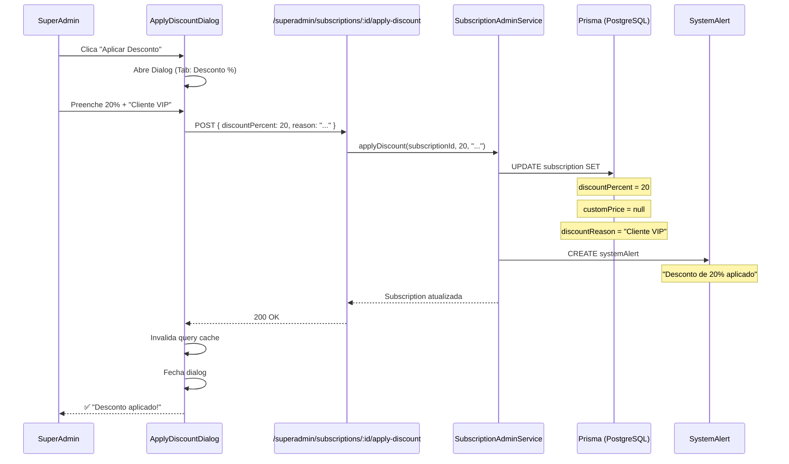
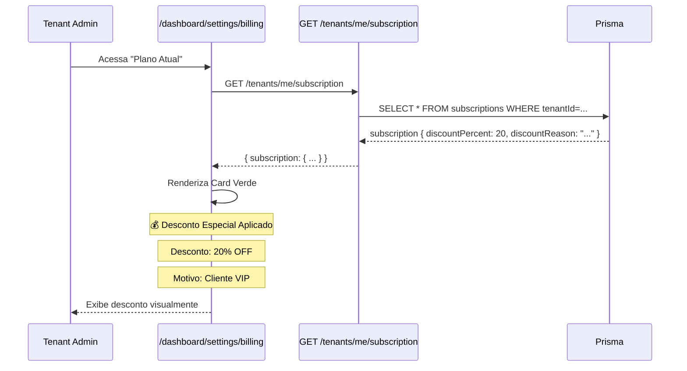

# 📊 Guia Completo: Sistema de Descontos e Preços Customizados

## 📌 Visão Geral

O sistema possui **duas formas de aplicar descontos/preços especiais** em subscriptions:

| Tipo | Campo no BD | Comportamento | Caso de Uso |
|------|-------------|---------------|-------------|
| **Desconto Percentual** | `discountPercent` | Reduz o `plan.price` em X% | Promoções, clientes VIP |
| **Preço Customizado** | `customPrice` | Substitui **completamente** o `plan.price` | Contratos especiais, acordos sob medida |

**⚠️ Regra Importante:** Os dois são **mutuamente exclusivos**. Ao aplicar um, o outro é automaticamente limpo (`null`).

---

## 🔐 Quem Pode Aplicar Descontos?

### ✅ SuperAdmin (Apenas)
- **PODE:** Aplicar `discountPercent` ou `customPrice`
- **PODE:** Remover descontos aplicados
- **ONDE:** Portal SuperAdmin (`/superadmin`)

### ❌ Tenant Admin (NÃO PODE)
- **NÃO PODE:** Aplicar descontos
- **PODE:** **Visualizar** descontos aplicados pelo SuperAdmin
- **ONDE:** Dashboard de Billing (`/dashboard/settings/billing`)

---

## 🛠️ Backend: Endpoints do SuperAdmin

### 1. Aplicar Desconto Percentual

**Endpoint:**
```http
POST /superadmin/subscriptions/:id/apply-discount
```

**Body:**
```json
{
  "discountPercent": 20,
  "reason": "Cliente VIP - Contrato anual"
}
```

**Validações:**
- ✅ `discountPercent` entre 0 e 100
- ✅ `reason` obrigatório (mínimo 3 caracteres)

**Efeito:**
```javascript
// ANTES
subscription.discountPercent = null
subscription.customPrice = null
subscription.discountReason = null

// DEPOIS
subscription.discountPercent = 20.00 (Decimal)
subscription.customPrice = null // Limpo automaticamente
subscription.discountReason = "Cliente VIP - Contrato anual"
```

**SystemAlert criado:**
```javascript
{
  type: 'SYSTEM_ERROR', // TODO: Criar tipo 'PRICING_CHANGED'
  severity: 'INFO',
  title: 'Desconto Aplicado',
  message: 'Desconto de 20% aplicado à subscription. Motivo: Cliente VIP - Contrato anual',
  metadata: {
    subscriptionId: '...',
    discountPercent: 20,
    reason: 'Cliente VIP - Contrato anual'
  }
}
```

**Arquivo:** [`apps/backend/src/superadmin/services/subscription-admin.service.ts:291`](apps/backend/src/superadmin/services/subscription-admin.service.ts#L291)

---

### 2. Aplicar Preço Customizado

**Endpoint:**
```http
POST /superadmin/subscriptions/:id/apply-custom-price
```

**Body:**
```json
{
  "customPrice": 149.90,
  "reason": "Acordo comercial especial - Q1 2025"
}
```

**Validações:**
- ✅ `customPrice` >= 0
- ✅ `reason` obrigatório (mínimo 3 caracteres)

**Efeito:**
```javascript
// ANTES
subscription.discountPercent = 20.00
subscription.customPrice = null
subscription.discountReason = "Cliente VIP"

// DEPOIS
subscription.discountPercent = null // Limpo automaticamente
subscription.customPrice = 149.90 (Decimal)
subscription.discountReason = "Acordo comercial especial - Q1 2025"
```

**SystemAlert criado:**
```javascript
{
  type: 'SYSTEM_ERROR',
  severity: 'INFO',
  title: 'Preço Customizado Aplicado',
  message: 'Preço customizado de R$ 149.90 aplicado à subscription. Motivo: Acordo comercial especial - Q1 2025',
  metadata: {
    subscriptionId: '...',
    customPrice: 149.90,
    reason: 'Acordo comercial especial - Q1 2025'
  }
}
```

**Arquivo:** [`apps/backend/src/superadmin/services/subscription-admin.service.ts:337`](apps/backend/src/superadmin/services/subscription-admin.service.ts#L337)

---

### 3. Remover Desconto/Preço Customizado

**Endpoint:**
```http
DELETE /superadmin/subscriptions/:id/discount
```

**Efeito:**
```javascript
subscription.discountPercent = null
subscription.customPrice = null
subscription.discountReason = null
```

**SystemAlert criado:**
```javascript
{
  type: 'SYSTEM_ERROR',
  severity: 'INFO',
  title: 'Desconto Removido',
  message: 'Desconto/preço customizado removido da subscription',
  metadata: { subscriptionId: '...' }
}
```

**Arquivo:** [`apps/backend/src/superadmin/services/subscription-admin.service.ts:380`](apps/backend/src/superadmin/services/subscription-admin.service.ts#L380)

---

## 🎨 Frontend: Interface SuperAdmin

### Componente: `ApplyDiscountDialog`

**Localização:** [`apps/frontend/src/components/superadmin/ApplyDiscountDialog.tsx`](apps/frontend/src/components/superadmin/ApplyDiscountDialog.tsx:1)

**Features:**
- ✅ Dialog modal com **2 tabs**:
  - Tab 1: **Desconto Percentual** (0-100%)
  - Tab 2: **Preço Customizado** (R$)
- ✅ Mostra desconto atual (se existir)
- ✅ Botão para **remover** desconto/preço customizado
- ✅ Validações em tempo real
- ✅ Preview do novo preço calculado

**Preview Visual:**

```
┌────────────────────────────────────────┐
│ Configurar Preço                     │
│ ──────────────────────────────────── │
│                                        │
│ Desconto Atual:                        │
│ ┌────────────────────────────────────┐ │
│ │ 20% de desconto                    │ │
│ │ Cliente VIP - Contrato anual       │ │
│ └────────────────────────────────────┘ │
│                                        │
│ ┌─────────────┬──────────────────────┐ │
│ │ Desconto %  │ Preço Fixo           │ │
│ └─────────────┴──────────────────────┘ │
│                                        │
│ Desconto Percentual (0-100%)           │
│ ┌────────────────────────────────────┐ │
│ │ 20                                 │ │
│ └────────────────────────────────────┘ │
│ Preço original: R$ 299.90              │
│ → Novo preço: R$ 239.92                │
│                                        │
│ Razão do Desconto                      │
│ ┌────────────────────────────────────┐ │
│ │ Cliente VIP - Contrato anual       │ │
│ └────────────────────────────────────┘ │
│                                        │
│ [Aplicar Desconto]                     │
│                                        │
│ ──────────────────────────────────── │
│ [🗑️ Remover Desconto/Preço Custom]    │
└────────────────────────────────────────┘
```

**Hooks utilizados:**
- `useApplySubscriptionDiscount()` → `POST /superadmin/subscriptions/:id/apply-discount`
- `useApplySubscriptionCustomPrice()` → `POST /superadmin/subscriptions/:id/apply-custom-price`
- `useRemoveSubscriptionDiscount()` → `DELETE /superadmin/subscriptions/:id/discount`

**Onde é usado:**
- **Portal SuperAdmin** → Detalhes da Subscription
- **Portal SuperAdmin** → Lista de Tenants (ação rápida)

---

## 👀 Frontend: Visualização pelo Tenant Admin

### Componente: `CurrentPlanTab` (Tenant Dashboard)

**Localização:** [`apps/frontend/src/pages/settings/CurrentPlanTab.tsx:51-109`](apps/frontend/src/pages/settings/CurrentPlanTab.tsx#L51)

**Renderização Condicional:**
```tsx
{((subscription as any).discountPercent || (subscription as any).customPrice) && (
  <Card className="bg-green-50 dark:bg-green-950/20 border-green-200 dark:border-green-800">
    <CardHeader>
      <CardTitle className="text-green-800 dark:text-green-300">
        💰 Desconto Especial Aplicado
      </CardTitle>
    </CardHeader>
    <CardContent>
      {/* Exibe discountPercent OU customPrice */}
      {/* Exibe discountReason */}
      <p className="text-xs text-green-600 mt-2">
        Este desconto foi aplicado pela nossa equipe. Aproveite!
      </p>
    </CardContent>
  </Card>
)}
```

**Preview Visual (Tenant vê isso):**

```
┌────────────────────────────────────────┐
│ 💰 Desconto Especial Aplicado          │
│ ──────────────────────────────────── │
│                                        │
│ Desconto: 20% OFF                      │
│ Motivo: Cliente VIP - Contrato anual   │
│                                        │
│ Este desconto foi aplicado pela        │
│ nossa equipe. Aproveite!               │
└────────────────────────────────────────┘
```

---

## 🔄 Fluxo Completo: Aplicação de Desconto

### Cenário: SuperAdmin quer dar 20% de desconto para cliente VIP



### Cenário: Tenant Admin visualiza o desconto



---

## 💰 Cálculo de Preço Efetivo

O preço efetivo de uma subscription segue esta lógica (em ordem de prioridade):

```javascript
function calculateEffectivePrice(subscription) {
  // 1. Preço customizado tem PRIORIDADE TOTAL
  if (subscription.customPrice !== null) {
    return subscription.customPrice
  }

  // 2. Desconto percentual aplicado ao preço do plano
  if (subscription.discountPercent !== null) {
    const basePrice = subscription.plan.price
    const discount = subscription.discountPercent / 100
    return basePrice * (1 - discount)
  }

  // 3. Preço padrão do plano
  return subscription.plan.price
}
```

### Exemplos:

| Plano Base | `discountPercent` | `customPrice` | Preço Efetivo | Explicação |
|------------|-------------------|---------------|---------------|------------|
| R$ 299,90  | `null` | `null` | **R$ 299,90** | Preço padrão |
| R$ 299,90  | `20` | `null` | **R$ 239,92** | 20% de desconto |
| R$ 299,90  | `null` | `149.90` | **R$ 149,90** | Preço fixo customizado |
| R$ 299,90  | `20` | `149.90` | **R$ 149,90** | CustomPrice **sempre** tem prioridade |

---

## 🔍 Auditoria e Logs

### 1. Logs de Aplicação (Console/CloudWatch)

Todos os endpoints do SuperAdmin geram logs estruturados:

```javascript
// Quando SuperAdmin aplica desconto
logger.log('[SUPERADMIN] Desconto de 20% aplicado à subscription abc-123 (tenant: xyz-789)')

// Quando Tenant faz upgrade (self-service)
logger.log('[TENANT-SELF-SERVICE] Upgrade solicitado: tenant=xyz-789 (Básico → Profissional) user=admin@ilpi.com')
```

**Diferenciação:**
- `[SUPERADMIN]` → Ação do SuperAdmin
- `[TENANT-SELF-SERVICE]` → Ação do próprio tenant

### 2. SystemAlerts (Banco de Dados)

Toda mudança de preço/desconto gera um `SystemAlert`:

```sql
SELECT * FROM system_alerts
WHERE tenant_id = 'xyz-789'
  AND title IN ('Desconto Aplicado', 'Preço Customizado Aplicado', 'Desconto Removido')
ORDER BY created_at DESC;
```

**Metadados armazenados:**
```json
{
  "subscriptionId": "abc-123",
  "discountPercent": 20,
  "customPrice": null,
  "reason": "Cliente VIP - Contrato anual"
}
```

### 3. Histórico de Mudanças (Frontend)

O componente `SubscriptionChangeHistory` exibe visualmente:
- ✅ Mudanças de plano (upgrade/downgrade)
- ✅ Aplicação de descontos (futuro: em implementação)
- ✅ Diferenciação visual: Self-Service (azul) vs SuperAdmin (roxo)

**Localização:** [`apps/frontend/src/components/billing/SubscriptionChangeHistory.tsx`](apps/frontend/src/components/billing/SubscriptionChangeHistory.tsx:1)

---

## 📊 Impacto em Métricas (MRR/ARR)

O `MetricsService` do SuperAdmin **já considera** descontos no cálculo de MRR:

```typescript
// apps/backend/src/superadmin/services/metrics.service.ts:50-68

// 1. Preço base (customPrice OU plan.price)
const basePrice = subscription.customPrice?.toNumber() || subscription.plan.price?.toNumber() || 0

// 2. Aplicar desconto percentual
const discount = subscription.discountPercent?.toNumber() || 0
const priceWithDiscount = basePrice * (1 - discount / 100)

// 3. Normalizar para mensal (se anual, divide por 12)
const monthlyValue = subscription.billingCycle === 'ANNUAL'
  ? priceWithDiscount / 12
  : priceWithDiscount

// MRR total = soma de todos os monthlyValue
mrr += monthlyValue
```

**Resultado:**
- ✅ Dashboard do SuperAdmin mostra **MRR real** (com descontos)
- ✅ ARR = MRR × 12 (também considera descontos)
- ✅ Métricas refletem receita **efetiva**

---

## ⚙️ Schema do Banco de Dados

**Arquivo:** [`apps/backend/prisma/schema/tenant.prisma:126`](apps/backend/prisma/schema/tenant.prisma#L126)

```prisma
model Subscription {
  id                 String    @id @default(uuid()) @db.Uuid
  tenantId           String    @db.Uuid
  planId             String    @db.Uuid
  status             String    // trialing | active | past_due | canceled | ...

  // ... outros campos ...

  // 🎯 PRICING OVERRIDES
  discountPercent Decimal? @db.Decimal(5, 2)  // 0.00 a 100.00
  discountReason  String?                      // Razão do desconto
  customPrice     Decimal? @db.Decimal(10, 2) // Preço customizado (override total)

  // ... relações ...

  @@map("subscriptions")
}
```

**Migration:** [`20251220202830_add_subscription_pricing_overrides`](apps/backend/prisma/migrations/20251220202830_add_subscription_pricing_overrides/migration.sql:1)

---

## 🚀 Próximos Passos (Melhorias Futuras)

### 1. Criar Enum de Tipos de SystemAlert
```prisma
enum AlertType {
  PRESCRIPTION_ALERT
  VITAL_SIGN_ALERT
  DOCUMENT_EXPIRING
  MEDICATION_ALERT
  POP_REVIEW_DUE
  SYSTEM_ERROR
  EVENTS_REMINDER
  PRICING_CHANGED  // ✨ NOVO
}
```

### 2. Histórico de Descontos no Tenant Dashboard
Adicionar filtro no `SubscriptionChangeHistory` para mostrar também mudanças de preço/desconto.

### 3. Notificação por Email ao Aplicar Desconto
Enviar email automático ao tenant admin informando sobre o desconto aplicado.

### 4. Validação de Desconto por Duração
Permitir descontos temporários (ex: "20% de desconto pelos próximos 3 meses").

---

## 📚 Referências

- [Documentação SuperAdmin Portal](docs/modules/portal-superadmin.md)
- [Documentação Tenant Billing](docs/modules/tenant-billing.md)
- [SubscriptionAdminService](apps/backend/src/superadmin/services/subscription-admin.service.ts)
- [ApplyDiscountDialog](apps/frontend/src/components/superadmin/ApplyDiscountDialog.tsx)
- [CurrentPlanTab](apps/frontend/src/pages/settings/CurrentPlanTab.tsx)

---

**Última atualização:** 2025-01-03
**Versão:** 1.0
**Mantido por:** Rafa Labs - Engineering Team
