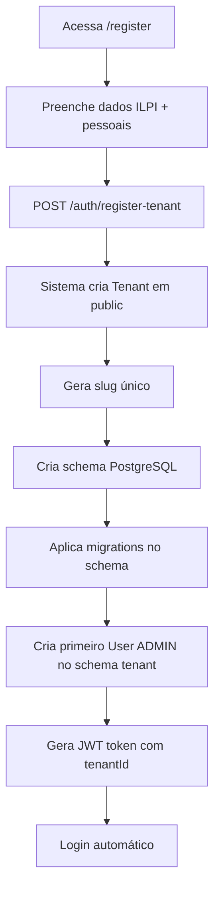
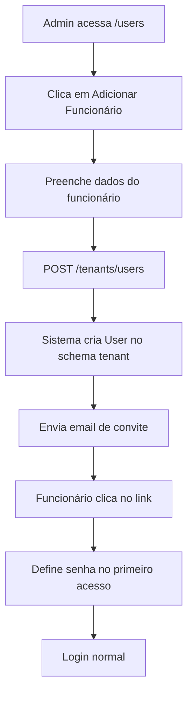

# 🔒 Arquitetura Multi-Tenant - Isolamento de Dados

**Projeto:** Rafa ILPI
**Data de Criação:** 13/11/2025
**Última Atualização:** 15/01/2026
**Autor:** Dr. Emanuel
**Status:** ✅ Implementado e Refatorado

---

## 📋 Sumário

1. [Visão Geral](#visão-geral)
2. [Decisões Arquiteturais](#decisões-arquiteturais)
3. [Fluxo de Registro](#fluxo-de-registro)
4. [Isolamento de Dados](#isolamento-de-dados)
5. [Implementação Técnica](#implementação-técnica)
6. [Padrões de Acesso](#padrões-de-acesso)
7. [Regras de Segurança](#regras-de-segurança)
8. [Múltiplos Tenants por Usuário](#múltiplos-tenants-por-usuário)

---

## 🎯 Visão Geral

O sistema Rafa ILPI implementa **isolamento físico completo de dados** utilizando o padrão **schema-per-tenant** no PostgreSQL. Cada ILPI possui seu próprio schema isolado no banco de dados, garantindo segurança máxima e conformidade com LGPD/RDC 502.

### Princípios Fundamentais

✅ **Isolamento Total:** Dados de um tenant nunca são acessíveis por outro
✅ **Sem Filtros tenantId:** Schema PostgreSQL já isola os dados
✅ **TenantContextService:** Injeção automática do client correto
✅ **Múltiplos Vínculos:** Um funcionário pode trabalhar em várias ILPIs
✅ **Segurança em Camadas:** Database → ORM → API → Frontend
✅ **LGPD Compliant:** Dados sensíveis protegidos desde o design

---

## 🏗️ Decisões Arquiteturais

### 1. Padrão Escolhido: Schema-per-Tenant

**Decisão:** Cada tenant tem seu próprio schema PostgreSQL isolado.

**Motivos:**
- ✅ Isolamento físico de dados (máxima segurança)
- ✅ Backup e restore por tenant independente
- ✅ Impossível fazer queries cross-tenant acidentalmente
- ✅ Performance superior (sem filtros `WHERE tenantId`)
- ✅ Conformidade LGPD facilitada (dados separados)
- ✅ Índices otimizados por tenant

**Alternativas Rejeitadas:**
- ❌ **Row-level security:** Risco de vazamento por erro de código
- ❌ **Database per tenant:** Overhead operacional muito alto
- ❌ **Shared schema com tenantId:** Impossível garantir isolamento 100%

### 2. Implementação com TenantContextService

**Decisão:**
- Service REQUEST-scoped injeta automaticamente o client do tenant correto
- Interceptor global inicializa contexto via JWT
- Services não recebem `tenantId` como parâmetro

**Vantagens:**
- ✅ Impossível esquecer de filtrar por tenantId
- ✅ Código mais limpo e seguro
- ✅ Performance superior (queries diretas no schema)
- ✅ Facilita manutenção e evita bugs

### 3. Registro vs Adição de Funcionários

**Decisão:**
- Auto-registro cria novo tenant (ILPI) + primeiro usuário ADMIN
- Funcionários são adicionados APENAS pelo admin do tenant

**Regras de Negócio:**

| Ação | Quem pode fazer | Resultado |
|------|-----------------|-----------|
| Registrar-se no sistema | Dono/Admin da ILPI | Cria tenant + vira ADMIN |
| Adicionar funcionário | Admin do tenant | Cria usuário vinculado ao tenant |
| Auto-registro de funcionário | ❌ NÃO PERMITIDO | - |
| Trocar de tenant sem permissão | ❌ NÃO PERMITIDO | - |

**Justificativa:**
- ✅ Apenas pessoas autorizadas criam ILPIs no sistema
- ✅ Admin tem controle total sobre quem acessa sua ILPI
- ✅ Evita registro indevido de funcionários
- ✅ Conformidade com responsabilidade legal (admin é responsável)

---

## 🔐 Fluxo de Registro

### Cenário 1: Dono/Administrador da ILPI



**Dados necessários:**
```typescript
{
  // Dados da ILPI
  ilpiName: "ILPI Boa Vida",
  cnpj: "12.345.678/0001-90",
  email: "contato@ilpiboavida.com.br",
  address: {...},

  // Dados do Admin
  adminName: "Dr. João Silva",
  adminEmail: "joao@ilpiboavida.com.br",
  adminPassword: "senha-segura",

  // Plano escolhido
  planId: "uuid-do-plano",

  // Aceite de termos
  privacyPolicyAccepted: true,
  acceptanceToken: "jwt-token-aceite"
}
```

**Sistema executa:**
1. Valida CNPJ único no `public.tenants`
2. Cria registro em `public.tenants`
3. Gera `schemaName` único (ex: `tenant_boavida_abc123`)
4. Executa SQL: `CREATE SCHEMA tenant_boavida_abc123`
5. Aplica migrations no novo schema via `prisma migrate deploy`
6. Cria primeiro usuário ADMIN no schema do tenant
7. Retorna JWT com `tenantId` incluído

### Cenário 2: Adição de Funcionário pelo Admin



**Dados necessários:**
```typescript
{
  name: "Maria Santos",
  email: "maria@email.com",
  cpf: "123.456.789-00",
  role: "USER", // ou MANAGER, VIEWER
  positionCode: "ENFERMEIRO",
  sendInviteEmail: true
}
```

**Sistema executa:**
1. Valida se requisitante é ADMIN do tenant
2. Obtém client do tenant via `TenantContextService`
3. Cria usuário no schema do tenant
4. Gera token de ativação (validade 48h)
5. Envia email com link: `/activate?token=xxx`
6. Funcionário define senha ao acessar link
7. Pode fazer login normalmente

---

## 🔒 Isolamento de Dados

### Estrutura de Schemas PostgreSQL

```sql
-- Schema Global (dados do sistema SaaS)
CREATE SCHEMA public;

-- Tabelas Globais (SHARED - 9 tabelas)
CREATE TABLE public.tenants (
  id UUID PRIMARY KEY,
  name VARCHAR(100),
  slug VARCHAR(100) UNIQUE,
  cnpj VARCHAR(18) UNIQUE,
  schema_name VARCHAR(100) UNIQUE, -- 'tenant_boavida_abc123'
  status VARCHAR(20),
  timezone VARCHAR(50) DEFAULT 'America/Sao_Paulo',
  created_at TIMESTAMP,
  deleted_at TIMESTAMP
);

CREATE TABLE public.plans (
  id UUID PRIMARY KEY,
  name VARCHAR(50),
  type VARCHAR(20), -- 'free', 'starter', 'professional', 'enterprise'
  max_residents INT,
  max_users INT,
  price_monthly DECIMAL(10,2)
);

CREATE TABLE public.subscriptions (
  id UUID PRIMARY KEY,
  tenant_id UUID REFERENCES tenants(id),
  plan_id UUID REFERENCES plans(id),
  status VARCHAR(20), -- 'active', 'cancelled', 'expired'
  start_date TIMESTAMP,
  end_date TIMESTAMP
);

-- Schema do Tenant A (ISOLATED - 66+ tabelas)
CREATE SCHEMA tenant_boavida_abc123;

CREATE TABLE tenant_boavida_abc123.users (
  id UUID PRIMARY KEY,
  tenant_id UUID NOT NULL, -- Mantido para referência/integridade
  email VARCHAR(255) NOT NULL,
  password VARCHAR(255),
  role VARCHAR(20),
  created_at TIMESTAMP,
  deleted_at TIMESTAMP,
  UNIQUE(email) -- Email único DENTRO do schema
);

CREATE TABLE tenant_boavida_abc123.residents (
  id UUID PRIMARY KEY,
  nome VARCHAR(255),
  cpf VARCHAR(14) UNIQUE,
  data_nascimento DATE,
  -- ... 60+ campos
  created_at TIMESTAMP,
  deleted_at TIMESTAMP
);

CREATE TABLE tenant_boavida_abc123.medications (
  id UUID PRIMARY KEY,
  resident_id UUID REFERENCES tenant_boavida_abc123.residents(id),
  medication VARCHAR(255),
  dosage VARCHAR(100),
  -- ... outros campos
);

-- Schema do Tenant B (COMPLETAMENTE ISOLADO)
CREATE SCHEMA tenant_vidanova_xyz456;

CREATE TABLE tenant_vidanova_xyz456.users (
  -- Mesma estrutura, dados DIFERENTES
);

CREATE TABLE tenant_vidanova_xyz456.residents (
  -- Mesma estrutura, dados DIFERENTES
);
```

### Garantias de Isolamento

1. **Impossível fazer JOIN cross-schema sem permissões explícitas**
   ```sql
   -- Isso NÃO funciona sem permissões especiais
   SELECT * FROM tenant_boavida_abc123.residents r
   JOIN tenant_vidanova_xyz456.residents r2 ON ...
   -- ERROR: permission denied for schema tenant_vidanova_xyz456
   ```

2. **Cada schema tem suas próprias sequences/indexes**
   - IDs não colidem entre tenants
   - Performance otimizada por tenant
   - Índices dedicados por tenant

3. **Backup por tenant**
   ```bash
   # Backup apenas de um tenant
   pg_dump -n tenant_boavida_abc123 -U postgres rafa_ilpi > backup_boavida.sql

   # Restore apenas de um tenant
   psql -U postgres rafa_ilpi < backup_boavida.sql
   ```

---

## 💻 Implementação Técnica

### 1. TenantContextService (REQUEST Scope)

**Localização:** `apps/backend/src/prisma/tenant-context.service.ts`

```typescript
import { Injectable, Scope } from '@nestjs/common';
import { PrismaClient } from '@prisma/client';
import { PrismaService } from './prisma.service';

@Injectable({ scope: Scope.REQUEST })
export class TenantContextService {
  private _tenantClient: PrismaClient | null = null;
  private _tenantId: string | null = null;

  constructor(private readonly prisma: PrismaService) {}

  /**
   * Inicializa o contexto do tenant para a request atual
   */
  async initialize(tenantId: string): Promise<void> {
    if (this._tenantClient) return; // Já inicializado

    this._tenantId = tenantId;

    // Buscar schema name do tenant
    const tenant = await this.prisma.tenant.findUnique({
      where: { id: tenantId },
      select: { schemaName: true }
    });

    if (!tenant) {
      throw new Error(`Tenant ${tenantId} não encontrado`);
    }

    // Obter client do tenant via PrismaService
    this._tenantClient = this.prisma.getTenantClient(tenant.schemaName);
  }

  /**
   * Retorna o client do tenant atual
   */
  get client(): PrismaClient {
    if (!this._tenantClient) {
      throw new Error('TenantContext não foi inicializado');
    }
    return this._tenantClient;
  }

  /**
   * Retorna o ID do tenant atual
   */
  get tenantId(): string {
    if (!this._tenantId) {
      throw new Error('TenantContext não foi inicializado');
    }
    return this._tenantId;
  }

  /**
   * Acesso ao client público (para tabelas SHARED)
   */
  get publicClient(): PrismaClient {
    return this.prisma;
  }
}
```

### 2. TenantContextInterceptor

**Localização:** `apps/backend/src/common/interceptors/tenant-context.interceptor.ts`

```typescript
import { Injectable, NestInterceptor, ExecutionContext, CallHandler } from '@nestjs/common';
import { Observable } from 'rxjs';
import { TenantContextService } from '../../prisma/tenant-context.service';

@Injectable()
export class TenantContextInterceptor implements NestInterceptor {
  constructor(private readonly tenantContext: TenantContextService) {}

  async intercept(context: ExecutionContext, next: CallHandler): Promise<Observable<any>> {
    const request = context.switchToHttp().getRequest();
    const user = request.user;

    // Inicializar contexto do tenant se usuário estiver autenticado
    if (user?.tenantId) {
      await this.tenantContext.initialize(user.tenantId);
    }

    return next.handle();
  }
}
```

### 3. Registro do Interceptor Global

**Localização:** `apps/backend/src/app.module.ts`

```typescript
import { APP_INTERCEPTOR } from '@nestjs/core';
import { TenantContextInterceptor } from './common/interceptors/tenant-context.interceptor';
import { TenantContextService } from './prisma/tenant-context.service';

@Module({
  providers: [
    TenantContextService,
    {
      provide: APP_INTERCEPTOR,
      useClass: TenantContextInterceptor,
    },
  ],
})
export class AppModule {}
```

---

## 📐 Padrões de Acesso

### Padrão 1: Services REQUEST-scoped (Maioria)

**Uso:** 95% dos services que acessam dados de tenant

```typescript
import { Injectable, Scope } from '@nestjs/common';
import { TenantContextService } from '../prisma/tenant-context.service';

@Injectable({ scope: Scope.REQUEST })
export class ResidentsService {
  constructor(private readonly tenantContext: TenantContextService) {}

  async findAll() {
    // ✅ Usa automaticamente o schema do tenant
    return this.tenantContext.client.resident.findMany({
      where: { deletedAt: null }, // ✅ SEM filtro tenantId!
      orderBy: { nome: 'asc' },
    });
  }

  async findOne(id: string) {
    // ✅ Busca apenas no schema do tenant
    return this.tenantContext.client.resident.findUnique({
      where: { id },
    });
  }

  async create(createResidentDto: CreateResidentDto) {
    // ✅ Cria no schema do tenant
    return this.tenantContext.client.resident.create({
      data: createResidentDto,
      // ✅ SEM tenantId - schema já isola!
    });
  }
}
```

### Padrão 2: getTenantClient() Manual (Services SHARED)

**Uso:** Services que gerenciam múltiplos tenants (ex: TenantsService, CronJobs)

```typescript
@Injectable()
export class NotificationsCron {
  constructor(private readonly prisma: PrismaService) {}

  @Cron(CronExpression.EVERY_DAY_AT_8AM)
  async checkScheduledEvents() {
    // Buscar todos os tenants ativos (SHARED table)
    const tenants = await this.prisma.tenant.findMany({
      where: { status: 'active', deletedAt: null },
    });

    for (const tenant of tenants) {
      // ✅ Obter client do tenant
      const tenantClient = this.prisma.getTenantClient(tenant.schemaName);

      // ✅ Buscar eventos no schema do tenant
      const events = await tenantClient.residentScheduledEvent.findMany({
        where: {
          status: 'SCHEDULED',
          scheduledDate: getCurrentDateInTz(tenant.timezone),
          deletedAt: null,
        },
      });

      // Processar eventos...
    }
  }
}
```

### Padrão 3: Acesso a Tabelas SHARED

**Uso:** Quando precisa acessar dados globais (tenants, plans, subscriptions)

```typescript
@Injectable({ scope: Scope.REQUEST })
export class InstitutionalProfileService {
  constructor(
    private readonly prisma: PrismaService, // Para tabelas SHARED
    private readonly tenantContext: TenantContextService, // Para tabelas tenant
  ) {}

  async getTenantInfo() {
    const tenantId = this.tenantContext.tenantId;

    // ✅ Buscar tenant em public schema
    const tenant = await this.prisma.tenant.findUnique({
      where: { id: tenantId },
      include: {
        subscription: {
          include: { plan: true },
        },
      },
    });

    // ✅ Buscar perfil no schema do tenant
    const profile = await this.tenantContext.client.tenantProfile.findFirst({
      where: { deletedAt: null },
    });

    return { tenant, profile };
  }
}
```

---

## 🛡️ Regras de Segurança (3 RED Rules)

### ❌ RED 1: Acessar TENANT table via public client

```typescript
// ❌ ERRADO - Acessa schema errado
const users = await this.prisma.user.findMany({
  where: { tenantId }, // RED FLAG!
});

// ✅ CORRETO - Usa client do tenant
const users = await this.tenantContext.client.user.findMany({
  where: { deletedAt: null },
});
```

### ❌ RED 2: Método público com parâmetro tenantId

```typescript
// ❌ ERRADO - Recebe tenantId como parâmetro
async findAll(tenantId: string) {
  return this.tenantContext.client.resident.findMany({ /* */ });
}

// ✅ CORRETO - Usa tenantId do contexto
async findAll() {
  // Se precisar do tenantId:
  const tenantId = this.tenantContext.tenantId;

  return this.tenantContext.client.resident.findMany({ /* */ });
}
```

### ❌ RED 3: Misturar public client com tenant client

```typescript
// ❌ ERRADO - Tenta JOIN cross-schema via Prisma
const resident = await this.prisma.resident.findUnique({
  where: { id },
  include: {
    createdBy: {
      include: { tenant: true }, // ❌ Cross-schema!
    },
  },
});

// ✅ CORRETO - Queries separadas
const resident = await this.tenantContext.client.resident.findUnique({
  where: { id },
});

// Se precisar de dados do tenant (public):
const tenant = await this.prisma.tenant.findUnique({
  where: { id: this.tenantContext.tenantId },
});

return { resident, tenant };
```

---

## 👥 Múltiplos Tenants por Usuário

### Cenário Real: João trabalha em 2 ILPIs

**Cadastros SEPARADOS no banco de dados:**

```typescript
// Schema tenant_boavida_abc123
tenant_boavida_abc123.users:
{
  id: "uuid-1",
  tenantId: "tenant-boavida-uuid",
  email: "joao@email.com",
  password: "$2b$10$hash1...",
  role: "MANAGER"
}

// Schema tenant_vidanova_xyz456
tenant_vidanova_xyz456.users:
{
  id: "uuid-2",
  tenantId: "tenant-vidanova-uuid",
  email: "joao@email.com",
  password: "$2b$10$hash2...", // Pode ser diferente!
  role: "USER"
}
```

### Fluxo de Login com Múltiplos Tenants

```typescript
// 1. João faz POST /auth/login
POST /auth/login
{
  email: "joao@email.com",
  password: "senha123"
}

// 2. Sistema busca em TODOS os tenant schemas
const tenants = await prisma.tenant.findMany({ where: { deletedAt: null } });

const users = await Promise.all(
  tenants.map(async (tenant) => {
    const client = prisma.getTenantClient(tenant.schemaName);
    return client.user.findFirst({
      where: { email: "joao@email.com", deletedAt: null },
    });
  })
);

// 3. Se múltiplos tenants, retorna lista
{
  requiresTenantSelection: true,
  tenants: [
    {
      id: "tenant-boavida-uuid",
      name: "ILPI Boa Vida",
      role: "MANAGER"
    },
    {
      id: "tenant-vidanova-uuid",
      name: "ILPI Vida Nova",
      role: "USER"
    }
  ]
}

// 4. Frontend mostra seletor de ILPI

// 5. João escolhe "ILPI Boa Vida"
POST /auth/login/select-tenant
{
  email: "joao@email.com",
  password: "senha123",
  tenantId: "tenant-boavida-uuid"
}

// 6. Sistema gera JWT específico
{
  accessToken: "jwt-token",
  user: {
    id: "uuid-1",
    email: "joao@email.com",
    tenantId: "tenant-boavida-uuid",
    role: "MANAGER"
  }
}
```

### Trocar de Tenant (sem fazer logout)

```typescript
// Frontend tem botão "Trocar ILPI"
POST /auth/switch-tenant
Authorization: Bearer current-jwt-token
{
  newTenantId: "tenant-vidanova-uuid"
}

// Sistema:
// 1. Valida que usuário tem cadastro nesse tenant
// 2. Gera novo JWT com tenantId atualizado
// 3. Frontend recebe novo token e recarrega dados
```

---

## 📊 Diagrama de Arquitetura

```
┌─────────────────────────────────────────────────────────┐
│                     FRONTEND (React)                     │
│  - AuthStore com tenantId                               │
│  - Axios interceptor adiciona Authorization header      │
│  - Seletor de ILPI (se múltiplos tenants)              │
└─────────────────────┬───────────────────────────────────┘
                      │
                      │ JWT Token (com tenantId)
                      │
┌─────────────────────▼───────────────────────────────────┐
│                   BACKEND (NestJS)                       │
│                                                           │
│  ┌─────────────────────────────────────────────────┐   │
│  │    JwtAuthGuard + TenantContextInterceptor      │   │
│  │  - Extrai tenantId do JWT                        │   │
│  │  - Inicializa TenantContextService               │   │
│  │  - Injeta client do tenant correto               │   │
│  └─────────────────┬───────────────────────────────┘   │
│                    │                                     │
│  ┌─────────────────▼───────────────────────────────┐   │
│  │            Controllers + Services                │   │
│  │  - Usa this.tenantContext.client.model          │   │
│  │  - Acessa apenas dados do schema atual          │   │
│  │  - Impossível acessar outro tenant              │   │
│  └─────────────────┬───────────────────────────────┘   │
└────────────────────┼─────────────────────────────────────┘
                     │
┌────────────────────▼─────────────────────────────────────┐
│              PostgreSQL 16 (Multi-Schema)                │
│                                                           │
│  ┌──────────────┐  ┌───────────────┐  ┌──────────────┐ │
│  │ Schema public│  │Schema tenant_A│  │Schema tenant_B│ │
│  │              │  │               │  │               │ │
│  │ - tenants    │  │ - users       │  │ - users       │ │
│  │ - plans      │  │ - residents   │  │ - residents   │ │
│  │ - subscrip.  │  │ - medications │  │ - medications │ │
│  │ - contracts  │  │ - daily_logs  │  │ - daily_logs  │ │
│  │ - templates  │  │ - audit_logs  │  │ - audit_logs  │ │
│  └──────────────┘  └───────────────┘  └──────────────┘ │
│                                                           │
│  ✅ Isolamento físico entre schemas                     │
│  ✅ Impossível fazer JOIN cross-schema                  │
│  ✅ Backup/restore independente por tenant              │
│  ✅ Performance superior (sem filtros WHERE tenantId)   │
└───────────────────────────────────────────────────────────┘
```

---

## ✅ Status de Implementação

### ✅ Fase 1 - Concluída (Nov/2025)
- [x] Schema Prisma com multi-tenancy
- [x] PrismaService com suporte a schemas dinâmicos
- [x] JWT incluindo tenantId
- [x] Guards básicos (JwtAuthGuard)
- [x] Decorators (@CurrentUser)

### ✅ Fase 2 - Concluída (Jan/2026)
- [x] TenantContextService (REQUEST scope)
- [x] TenantContextInterceptor (global)
- [x] Refatoração de TODOS os 56 services
- [x] Eliminação de filtros `where: { tenantId }`
- [x] Padrão getTenantClient() para cron jobs
- [x] Sistema de validação multi-tenant (ESLint rules)
- [x] AuthService com seleção de tenant
- [x] Endpoint /auth/switch-tenant

### 🔄 Fase 3 - Em andamento
- [ ] Frontend: seletor de ILPI (em testes)
- [ ] Frontend: botão trocar ILPI
- [ ] Sistema de convite por email (parcialmente implementado)

### 📅 Fase 4 - Futuro
- [ ] Auditoria de acesso cross-tenant
- [ ] Rate limiting por tenant
- [ ] Logs de troca de tenant
- [ ] Dashboard de uso por tenant
- [ ] Health check de schemas por tenant

---

## 📝 Notas Importantes

1. **Email não é único global:** O mesmo email pode existir em múltiplos tenants
2. **Senhas podem ser diferentes:** Usuário pode ter senhas diferentes em cada tenant
3. **Roles são por tenant:** ADMIN em um tenant não significa ADMIN em outro
4. **JWT é específico:** Cada token é válido para UM tenant por vez
5. **Troca de tenant = novo JWT:** Trocar ILPI requer novo token
6. **TenantContextService é REQUEST-scoped:** Uma instância por requisição HTTP
7. **PrismaService mantém cache de clients:** Performance otimizada para schemas já conectados

---

## 🔗 Referências

- **Documentação técnica:** [multi-tenancy.md](./multi-tenancy.md)
- **Ferramentas de validação:** [MULTI-TENANT-VALIDATION.md](./MULTI-TENANT-VALIDATION.md)
- **Prisma Multi-Schema:** https://www.prisma.io/docs/guides/database/multi-schema
- **PostgreSQL Schemas:** https://www.postgresql.org/docs/current/ddl-schemas.html
- **LGPD:** https://www.planalto.gov.br/ccivil_03/_ato2015-2018/2018/lei/l13709.htm
- **RDC 502/2021 ANVISA:** Art. 62 (Proteção de dados pessoais)
- **OWASP Multi-Tenancy:** https://cheatsheetseries.owasp.org/cheatsheets/Multitenant_Architecture_Cheat_Sheet.html

---

**Última atualização:** 15/01/2026
**Próxima revisão:** Após conclusão da Fase 3
