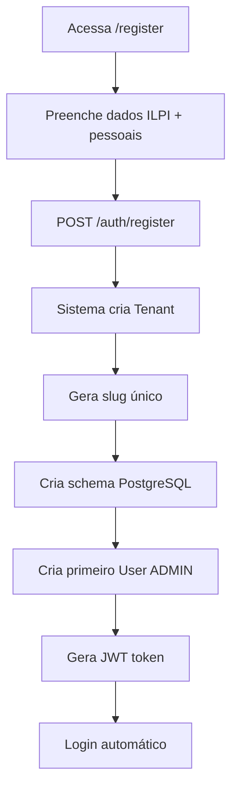
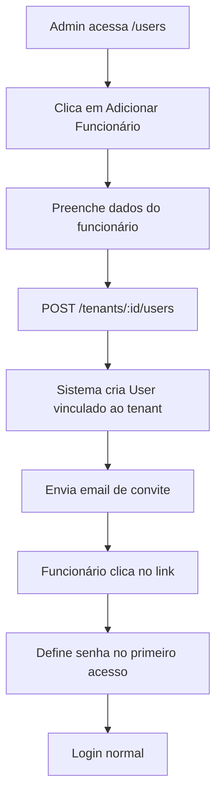

# 🔒 Arquitetura Multi-Tenant - Isolamento de Dados

**Projeto:** Rafa ILPI
**Data:** 13/11/2025
**Autor:** Dr. Emanuel
**Status:** ✅ Aprovado e Implementado

---

## 📋 Sumário

1. [Visão Geral](#visão-geral)
2. [Decisões Arquiteturais](#decisões-arquiteturais)
3. [Fluxo de Registro](#fluxo-de-registro)
4. [Isolamento de Dados](#isolamento-de-dados)
5. [Múltiplos Tenants por Usuário](#múltiplos-tenants-por-usuário)
6. [Segurança em Camadas](#segurança-em-camadas)
7. [Implementação Técnica](#implementação-técnica)

---

## 🎯 Visão Geral

O sistema Rafa ILPI implementa **isolamento total de dados** entre tenants (ILPIs) utilizando o padrão **schema-per-tenant** no PostgreSQL. Cada ILPI possui seu próprio schema isolado no banco de dados, garantindo segurança e conformidade com LGPD.

### Princípios Fundamentais

✅ **Isolamento Total:** Dados de um tenant nunca são acessíveis por outro
✅ **Múltiplos Vínculos:** Um funcionário pode trabalhar em várias ILPIs
✅ **Segurança em Camadas:** Database → ORM → API → Frontend
✅ **LGPD Compliant:** Dados sensíveis protegidos desde o design

---

## 🏗️ Decisões Arquiteturais

### 1. Padrão Escolhido: Schema-per-Tenant

**Decisão:** Cada tenant tem seu próprio schema PostgreSQL isolado.

**Motivos:**
- ✅ Isolamento físico de dados (máxima segurança)
- ✅ Backup e restore por tenant independente
- ✅ Impossível fazer queries cross-tenant acidentalmente
- ✅ Conformidade LGPD facilitada (dados separados)
- ✅ Melhor performance (índices otimizados por tenant)

**Alternativas Rejeitadas:**
- ❌ **Row-level security:** Risco de vazamento por erro de código
- ❌ **Database per tenant:** Overhead operacional muito alto
- ❌ **Shared schema:** Impossível garantir isolamento 100%

### 2. Registro vs Adição de Funcionários

**Decisão:**
- Auto-registro cria novo tenant (ILPI) + primeiro usuário ADMIN
- Funcionários são adicionados APENAS pelo admin do tenant

**Regras de Negócio:**

| Ação | Quem pode fazer | Resultado |
|------|-----------------|-----------|
| Registrar-se no sistema | Dono/Admin da ILPI | Cria tenant + vira ADMIN |
| Adicionar funcionário | Admin do tenant | Cria usuário vinculado ao tenant |
| Auto-registro de funcionário | ❌ NÃO PERMITIDO | - |
| Trocar de tenant sem permissão | ❌ NÃO PERMITIDO | - |

**Justificativa:**
- ✅ Apenas pessoas autorizadas criam ILPIs no sistema
- ✅ Admin tem controle total sobre quem acessa sua ILPI
- ✅ Evita registro indevido de funcionários
- ✅ Conformidade com responsabilidade legal (admin é responsável)

---

## 🔐 Fluxo de Registro

### Cenário 1: Dono/Administrador da ILPI



**Dados necessários:**
```typescript
{
  // Dados da ILPI
  ilpiName: "ILPI Boa Vida",
  cnpj: "12.345.678/0001-90",
  email: "contato@ilpiboavida.com.br",
  address: {...},

  // Dados do Admin
  adminName: "Dr. João Silva",
  adminEmail: "joao@ilpiboavida.com.br",
  adminPassword: "senha-segura",

  // Plano escolhido
  planId: "uuid-do-plano"
}
```

**Sistema executa:**
1. Valida CNPJ único
2. Cria registro em `tenants`
3. Gera `schemaName` único (ex: `tenant_boavida_abc123`)
4. Executa SQL: `CREATE SCHEMA tenant_boavida_abc123`
5. Aplica migrations no novo schema (tabelas: residents, medications, etc)
6. Cria primeiro usuário com `role: ADMIN`
7. Retorna JWT com `tenantId` incluído

### Cenário 2: Adição de Funcionário pelo Admin



**Dados necessários:**
```typescript
{
  name: "Maria Santos",
  email: "maria@email.com",
  role: "USER", // ou MANAGER, VIEWER
  sendInviteEmail: true,
  temporaryPassword?: "opcional"
}
```

**Sistema executa:**
1. Valida se requisitante é ADMIN do tenant
2. Cria usuário com `tenantId` do admin
3. Gera token de ativação (validade 48h)
4. Envia email com link: `/activate?token=xxx`
5. Funcionário define senha ao acessar link
6. Pode fazer login normalmente

---

## 🔒 Isolamento de Dados

### Estrutura de Schemas PostgreSQL

```sql
-- Schema Global (dados do sistema)
CREATE SCHEMA public;

-- Tabelas Globais
CREATE TABLE public.plans (
  id UUID PRIMARY KEY,
  name VARCHAR(50),
  type VARCHAR(20),
  maxResidents INT,
  maxUsers INT,
  priceMonthly DECIMAL(10,2)
);

CREATE TABLE public.tenants (
  id UUID PRIMARY KEY,
  name VARCHAR(100),
  slug VARCHAR(100) UNIQUE,
  cnpj VARCHAR(18) UNIQUE,
  schemaName VARCHAR(100) UNIQUE, -- 'tenant_boavida_abc123'
  status VARCHAR(20),
  createdAt TIMESTAMP
);

CREATE TABLE public.users (
  id UUID PRIMARY KEY,
  tenantId UUID REFERENCES tenants(id),
  email VARCHAR(255),
  password VARCHAR(255), -- bcrypt hash
  role VARCHAR(20),
  UNIQUE(tenantId, email) -- Email único POR TENANT
);

-- Schema do Tenant A
CREATE SCHEMA tenant_boavida_abc123;

CREATE TABLE tenant_boavida_abc123.residents (
  id UUID PRIMARY KEY,
  nome VARCHAR(255),
  cpf VARCHAR(14) UNIQUE,
  dataNascimento DATE,
  -- ... 60+ campos
);

CREATE TABLE tenant_boavida_abc123.medications (
  id UUID PRIMARY KEY,
  residentId UUID REFERENCES tenant_boavida_abc123.residents(id),
  medication VARCHAR(255),
  dosage VARCHAR(100)
);

-- Schema do Tenant B (COMPLETAMENTE ISOLADO)
CREATE SCHEMA tenant_vidanova_xyz456;

CREATE TABLE tenant_vidanova_xyz456.residents (
  -- Mesma estrutura, dados DIFERENTES
);
```

### Garantias de Isolamento

1. **Impossível fazer JOIN cross-schema sem permissões explícitas**
   ```sql
   -- Isso NÃO funciona sem permissões
   SELECT * FROM tenant_boavida_abc123.residents r
   JOIN tenant_vidanova_xyz456.residents r2 ON ...
   ```

2. **Cada schema tem suas próprias sequences/indexes**
   - IDs não colidem entre tenants
   - Performance otimizada por tenant

3. **Backup por tenant**
   ```bash
   # Backup apenas de um tenant
   pg_dump -n tenant_boavida_abc123 > backup_boavida.sql
   ```

---

## 👥 Múltiplos Tenants por Usuário

### Cenário Real: João trabalha em 2 ILPIs

```typescript
// Cadastros SEPARADOS no banco de dados

// Cadastro 1: João na ILPI Boa Vida
{
  id: "uuid-1",
  tenantId: "tenant-boavida-uuid",
  email: "joao@email.com",
  password: "$2b$10$hash1...", // pode ser diferente
  role: "MANAGER",
  tenant: {
    id: "tenant-boavida-uuid",
    name: "ILPI Boa Vida",
    schemaName: "tenant_boavida_abc123"
  }
}

// Cadastro 2: João na ILPI Vida Nova (DADOS ISOLADOS)
{
  id: "uuid-2",
  tenantId: "tenant-vidanova-uuid",
  email: "joao@email.com",
  password: "$2b$10$hash2...", // pode ser diferente
  role: "USER",
  tenant: {
    id: "tenant-vidanova-uuid",
    name: "ILPI Vida Nova",
    schemaName: "tenant_vidanova_xyz456"
  }
}
```

### Fluxo de Login com Múltiplos Tenants

```typescript
// 1. João faz POST /auth/login
{
  email: "joao@email.com",
  password: "senha123"
}

// 2. Sistema busca todos os cadastros desse email
const users = await prisma.user.findMany({
  where: { email: "joao@email.com" },
  include: { tenant: true }
});

// 3. Se múltiplos tenants, retorna lista
{
  requiresTenantSelection: true,
  tenants: [
    {
      id: "tenant-boavida-uuid",
      name: "ILPI Boa Vida",
      role: "MANAGER"
    },
    {
      id: "tenant-vidanova-uuid",
      name: "ILPI Vida Nova",
      role: "USER"
    }
  ]
}

// 4. Frontend mostra seletor de ILPI
// 5. João escolhe "ILPI Boa Vida"

// 6. POST /auth/login/select-tenant
{
  email: "joao@email.com",
  password: "senha123",
  tenantId: "tenant-boavida-uuid"
}

// 7. Sistema gera JWT específico
{
  accessToken: "jwt-token",
  refreshToken: "refresh-token",
  user: {
    id: "uuid-1",
    email: "joao@email.com",
    tenantId: "tenant-boavida-uuid",
    role: "MANAGER"
  }
}
```

### Trocar de Tenant (sem fazer logout)

```typescript
// Frontend tem botão "Trocar ILPI"
// POST /auth/switch-tenant
{
  newTenantId: "tenant-vidanova-uuid"
}

// Sistema:
// 1. Valida que usuário tem cadastro nesse tenant
// 2. Gera novo JWT com tenantId atualizado
// 3. Frontend recarrega dados do novo tenant
```

---

## 🛡️ Segurança em Camadas

### Camada 1: Database (PostgreSQL)

```sql
-- Schemas fisicamente separados
-- Permissões PostgreSQL impedem cross-schema access
GRANT USAGE ON SCHEMA tenant_boavida_abc123 TO app_user;
REVOKE ALL ON SCHEMA tenant_vidanova_xyz456 FROM app_user;
```

### Camada 2: ORM (Prisma)

```typescript
// PrismaService conecta no schema correto automaticamente
export class PrismaService extends PrismaClient {
  async connectToTenant(tenantId: string) {
    const tenant = await this.tenant.findUnique({
      where: { id: tenantId }
    });

    // Executa: SET search_path TO tenant_boavida_abc123;
    await this.$executeRaw`SET search_path TO ${tenant.schemaName}`;
  }
}
```

### Camada 3: API (NestJS)

```typescript
// Guards validam tenantId em TODA request
@UseGuards(JwtAuthGuard)
export class ResidentsController {
  constructor(private prisma: PrismaService) {}

  @Get()
  async findAll(@CurrentUser() user: JwtPayload) {
    // Conecta no schema correto automaticamente
    await this.prisma.connectToTenant(user.tenantId);

    // Query automática no schema certo
    return this.prisma.resident.findMany();
    // SELECT * FROM tenant_boavida_abc123.residents
  }
}
```

### Camada 4: Frontend (React)

```typescript
// AuthStore persiste tenantId
const authStore = create((set) => ({
  user: null,
  tenantId: null,

  setAuth: (user) => {
    set({
      user,
      tenantId: user.tenantId
    });

    // Token JWT sempre inclui tenantId
    localStorage.setItem('token', user.accessToken);
  }
}));

// Axios interceptor adiciona tenantId em headers
axios.interceptors.request.use((config) => {
  const { tenantId } = authStore.getState();
  if (tenantId) {
    config.headers['X-Tenant-ID'] = tenantId;
  }
  return config;
});
```

---

## 💻 Implementação Técnica

### JWT Payload

```typescript
interface JwtPayload {
  userId: string;
  email: string;
  tenantId: string;  // SEMPRE presente
  role: string;      // ADMIN, MANAGER, USER, VIEWER
  iat: number;
  exp: number;
}
```

### Decorator @CurrentUser

```typescript
export const CurrentUser = createParamDecorator(
  (data: unknown, ctx: ExecutionContext): JwtPayload => {
    const request = ctx.switchToHttp().getRequest();
    return request.user; // Inclui tenantId
  },
);
```

### Guard de Tenant (Automático)

```typescript
@Injectable()
export class TenantGuard implements CanActivate {
  constructor(private prisma: PrismaService) {}

  async canActivate(context: ExecutionContext): Promise<boolean> {
    const request = context.switchToHttp().getRequest();
    const user: JwtPayload = request.user;

    if (!user?.tenantId) {
      throw new UnauthorizedException('Tenant ID não encontrado');
    }

    // Conecta automaticamente no schema correto
    await this.prisma.connectToTenant(user.tenantId);

    return true;
  }
}
```

### Uso nos Controllers

```typescript
@Controller('residents')
@UseGuards(JwtAuthGuard, TenantGuard) // TenantGuard conecta no schema
export class ResidentsController {
  @Get()
  async findAll(@CurrentUser() user: JwtPayload) {
    // Já está no schema correto (tenant_boavida_abc123)
    // Não precisa passar tenantId manualmente
    return this.residentsService.findAll();
  }

  @Post()
  async create(
    @Body() dto: CreateResidentDto,
    @CurrentUser() user: JwtPayload
  ) {
    // Schema já configurado pelo TenantGuard
    return this.residentsService.create(dto);
  }
}
```

---

## 📊 Diagrama de Arquitetura

```
┌─────────────────────────────────────────────────────────┐
│                     FRONTEND (React)                     │
│  - AuthStore com tenantId                               │
│  - Axios interceptor adiciona X-Tenant-ID              │
│  - Seletor de ILPI (se múltiplos tenants)              │
└─────────────────────┬───────────────────────────────────┘
                      │
                      │ JWT Token (com tenantId)
                      │
┌─────────────────────▼───────────────────────────────────┐
│                   BACKEND (NestJS)                       │
│                                                           │
│  ┌─────────────────────────────────────────────────┐   │
│  │         Guards (JwtAuthGuard + TenantGuard)     │   │
│  │  - Extrai tenantId do JWT                        │   │
│  │  - Conecta PrismaService no schema correto      │   │
│  └─────────────────┬───────────────────────────────┘   │
│                    │                                     │
│  ┌─────────────────▼───────────────────────────────┐   │
│  │            Controllers + Services                │   │
│  │  - Acessa apenas dados do schema atual          │   │
│  │  - Impossível acessar outro tenant              │   │
│  └─────────────────┬───────────────────────────────┘   │
└────────────────────┼─────────────────────────────────────┘
                     │
┌────────────────────▼─────────────────────────────────────┐
│              PostgreSQL 16 (Multi-Schema)                │
│                                                           │
│  ┌──────────────┐  ┌───────────────┐  ┌──────────────┐ │
│  │ Schema public│  │Schema tenant_A│  │Schema tenant_B│ │
│  │              │  │               │  │               │ │
│  │ - plans      │  │ - residents   │  │ - residents   │ │
│  │ - tenants    │  │ - medications │  │ - medications │ │
│  │ - users      │  │ - daily_logs  │  │ - daily_logs  │ │
│  └──────────────┘  └───────────────┘  └──────────────┘ │
│                                                           │
│  ✅ Isolamento físico entre schemas                     │
│  ✅ Impossível fazer JOIN cross-schema                  │
│  ✅ Backup/restore independente por tenant              │
└───────────────────────────────────────────────────────────┘
```

---

## ✅ Checklist de Implementação

### Fase 1 (Concluída)
- [x] Schema Prisma com multi-tenancy
- [x] PrismaService com suporte a schemas dinâmicos
- [x] JWT incluindo tenantId
- [x] Guards básicos (JwtAuthGuard)
- [x] Decorators (@CurrentUser)

### Fase 2 (A implementar)
- [ ] TenantGuard automático
- [ ] AuthService com seleção de tenant
- [ ] Endpoint /auth/switch-tenant
- [ ] TenantsModule (CRUD + adicionar usuários)
- [ ] Frontend: seletor de ILPI
- [ ] Frontend: botão trocar ILPI
- [ ] Sistema de convite por email

### Fase 3 (Futuro)
- [ ] Auditoria de acesso cross-tenant
- [ ] Rate limiting por tenant
- [ ] Logs de troca de tenant
- [ ] Dashboard de uso por tenant

---

## 📝 Notas Importantes

1. **Email não é único global:** O mesmo email pode existir em múltiplos tenants
2. **Senhas podem ser diferentes:** Usuário pode ter senhas diferentes em cada tenant
3. **Roles são por tenant:** ADMIN em um tenant não significa ADMIN em outro
4. **JWT é específico:** Cada token é válido para UM tenant por vez
5. **Troca de tenant = novo JWT:** Trocar ILPI requer novo token

---

## 🔗 Referências

- [Prisma Multi-Schema](https://www.prisma.io/docs/guides/database/multi-schema)
- [PostgreSQL Schema Documentation](https://www.postgresql.org/docs/current/ddl-schemas.html)
- [LGPD - Lei Geral de Proteção de Dados](https://www.planalto.gov.br/ccivil_03/_ato2015-2018/2018/lei/l13709.htm)
- [OWASP Multi-Tenancy Cheat Sheet](https://cheatsheetseries.owasp.org/cheatsheets/Multitenant_Architecture_Cheat_Sheet.html)

---

**Última atualização:** 13/11/2025
**Próxima revisão:** Após implementação da Fase 2
