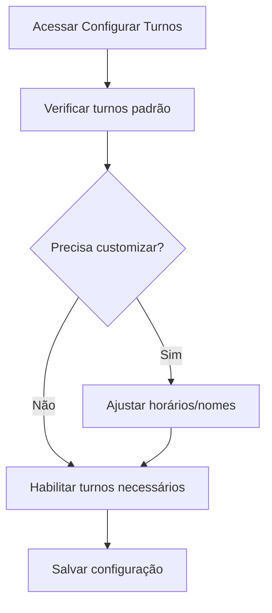
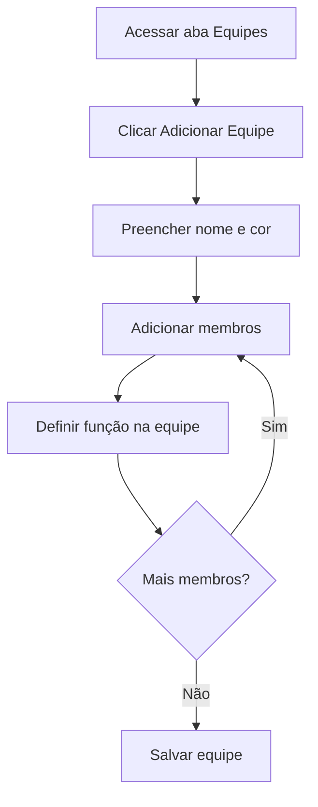
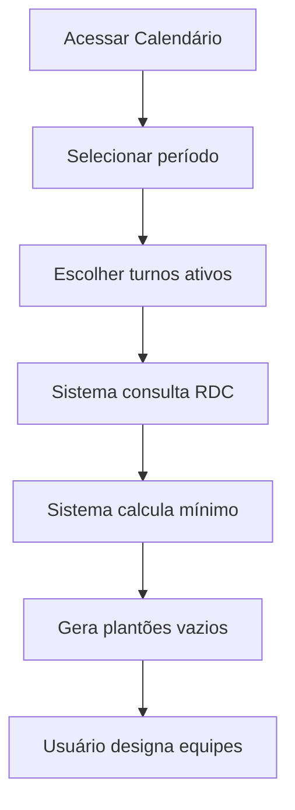
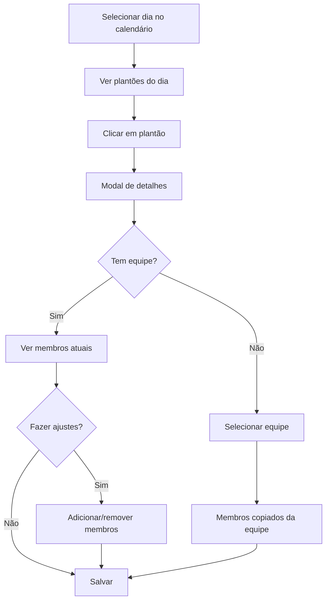
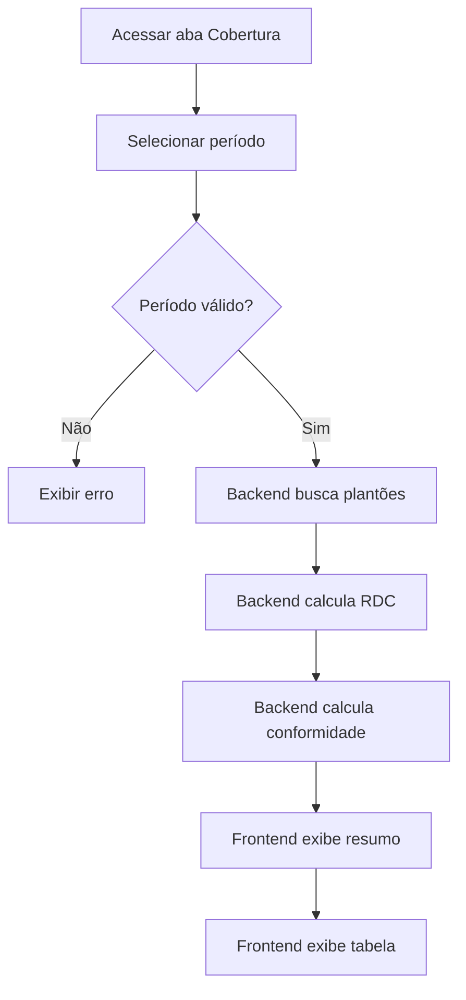

# Módulo de Escalas de Cuidados

## Visão Geral

O **Módulo de Escalas de Cuidados** é responsável pela gestão completa da cobertura assistencial 24 horas em Instituições de Longa Permanência para Idosos (ILPIs), garantindo conformidade com a **RDC 502/2021** da ANVISA.

### Principais Funcionalidades

1. **Gestão de Turnos** - Configuração de turnos fixos (8h e 12h) com horários personalizáveis
2. **Gestão de Equipes** - Criação e organização de equipes reutilizáveis de cuidadores
3. **Gestão de Plantões** - Planejamento e acompanhamento de plantões concretos (data + turno + equipe)
4. **Cálculo RDC Automático** - Dimensionamento mínimo de cuidadores baseado no grau de dependência dos residentes
5. **Relatório de Cobertura** - Análise de conformidade por período com indicadores visuais
6. **Calendário Visual** - Visualização mensal dos plantões com indicadores de equipes

---

## Arquitetura

### Modelo de Dados

#### 1. Turnos Fixos do Sistema (Public Schema)

```prisma
model ShiftTemplate {
  id           String            // UUID fixo (definido em seed)
  type         ShiftTemplateType // DAY_8H, AFTERNOON_8H, NIGHT_8H, DAY_12H, NIGHT_12H
  name         String            // "Dia 8h", "Tarde 8h", "Noite 8h", etc.
  startTime    String            // "07:00" (HH:mm)
  endTime      String            // "15:00" (HH:mm)
  duration     Int               // 8 ou 12 horas
  description  String?
  isActive     Boolean
  displayOrder Int
}
```

**Turnos Padrão (UUIDs fixos):**
- `10000000-0000-4000-8000-000000000001` - Dia 8h (07:00-15:00)
- `10000000-0000-4000-8000-000000000002` - Tarde 8h (15:00-23:00)
- `10000000-0000-4000-8000-000000000003` - Noite 8h (23:00-07:00)
- `10000000-0000-4000-8000-000000000004` - Dia 12h (07:00-19:00)
- `10000000-0000-4000-8000-000000000005` - Noite 12h (19:00-07:00)

#### 2. Configuração de Turnos por Tenant

```prisma
model TenantShiftConfig {
  id              String
  tenantId        String
  shiftTemplateId String   // FK para public.shift_templates (cross-schema)
  isEnabled       Boolean  // Tenant pode desabilitar turnos não utilizados
  customName      String?  // Nome customizado (ex: "Plantão Manhã")
  customStartTime String?  // Horário customizado (ex: "08:00")
  customEndTime   String?
  customDuration  Int?
}
```

**Funcionalidade**: Permite que cada ILPI customize os horários dos turnos padrão ou desabilite turnos não utilizados.

#### 3. Equipes de Cuidadores

```prisma
model Team {
  id          String
  tenantId    String
  name        String   // "Equipe A Manhã", "Equipe B Noite"
  description String?
  isActive    Boolean
  color       String?  // Hex color para UI (#FF5733)

  members               TeamMember[]
  shifts                Shift[]
}
```

#### 4. Membros das Equipes

```prisma
model TeamMember {
  id       String
  tenantId String
  teamId   String
  userId   String  // FK para users (same-schema)
  role     String? // "Líder", "Substituto", etc.

  addedBy   String
  addedAt   DateTime
  removedBy String?
  removedAt DateTime?  // Soft delete
}
```

**Importante**: O campo `role` armazena a **função na equipe** (ex: "Líder", "Substituto"), diferente do cargo funcional do usuário (enfermeiro, técnico).

#### 5. Plantões Concretos

```prisma
model Shift {
  id              String
  tenantId        String
  date            Date         // Data específica do plantão
  shiftTemplateId String       // FK para public.shift_templates (cross-schema)
  teamId          String?      // null = sem equipe designada
  status          ShiftStatus  // SCHEDULED, IN_PROGRESS, COMPLETED, CANCELLED
  notes           String?
  versionNumber   Int          // Para versionamento de alterações

  members       ShiftAssignment[]
  substitutions ShiftSubstitution[]
  history       ShiftHistory[]
}
```

**Status possíveis**:
- `SCHEDULED` - Agendado (padrão)
- `IN_PROGRESS` - Em andamento
- `COMPLETED` - Concluído
- `CANCELLED` - Cancelado

#### 6. Designações de Membros

```prisma
model ShiftAssignment {
  id         String
  tenantId   String
  shiftId    String
  userId     String
  isFromTeam Boolean  // true = veio da equipe, false = adicionado manualmente

  assignedBy String
  assignedAt DateTime
  removedBy  String?
  removedAt  DateTime?  // Soft delete
}
```

#### 7. Substituições Pontuais

```prisma
model ShiftSubstitution {
  id       String
  tenantId String
  shiftId  String
  type     SubstitutionType  // TEAM_REPLACEMENT, MEMBER_REPLACEMENT, MEMBER_ADDITION
  reason   String            // Motivo obrigatório

  // Para TEAM_REPLACEMENT
  originalTeamId String?
  newTeamId      String?

  // Para MEMBER_REPLACEMENT / MEMBER_ADDITION
  originalUserId String?
  newUserId      String?

  substitutedBy String
  substitutedAt DateTime
}
```

**Tipos de Substituição**:
- `TEAM_REPLACEMENT` - Troca de equipe inteira
- `MEMBER_REPLACEMENT` - Troca de um membro específico
- `MEMBER_ADDITION` - Adição de membro extra

#### 8. Histórico de Versionamento

```prisma
model ShiftHistory {
  id            String
  tenantId      String
  shiftId       String
  versionNumber Int
  changeType    ChangeType  // CREATE, UPDATE, DELETE
  changeReason  String      // Motivo obrigatório (min 10 chars)

  previousData  Json?       // null em CREATE
  newData       Json
  changedFields String[]    // ["teamId", "status"]

  changedBy String
  changedAt DateTime
}
```

---

## Cálculo RDC 502/2021

### Fórmula de Dimensionamento

A RDC 502/2021 define o número mínimo de cuidadores por turno baseado no grau de dependência dos residentes:

```typescript
minimumRequired = Math.ceil(
  (grauI * 0.25) +      // Grau I: 1 cuidador para cada 4 residentes
  (grauII * 0.5) +      // Grau II: 1 cuidador para cada 2 residentes
  (grauIII * 1)         // Grau III: 1 cuidador para cada 1 residente
);
```

**Exemplo**:
- 10 residentes Grau I → 10 * 0.25 = 2.5 → **3 cuidadores**
- 5 residentes Grau II → 5 * 0.5 = 2.5 → **3 cuidadores**
- 3 residentes Grau III → 3 * 1 = 3 → **3 cuidadores**
- **Total mínimo: 9 cuidadores por turno**

### Status de Conformidade

```typescript
type ComplianceStatus = 'compliant' | 'attention' | 'non_compliant';
```

| Status | Critério | Badge |
|--------|----------|-------|
| `compliant` | `assignedCount >= minimumRequired` | 🟢 Verde |
| `attention` | `assignedCount < minimumRequired && assignedCount > 0` | 🟡 Amarelo |
| `non_compliant` | `assignedCount === 0` | 🔴 Vermelho |

---

## Fluxos de Trabalho

### 1. Configuração Inicial



### 2. Criação de Equipes



### 3. Geração de Plantões



### 4. Designação de Equipes



### 5. Relatório de Cobertura



---

## API Backend

### Endpoints Principais

#### 1. Cálculo RDC para Data Específica

```http
GET /api/care-shifts/rdc-calculation?date=2026-01-23&shiftTemplateId=uuid
```

**Resposta**:
```json
{
  "date": "2026-01-23",
  "calculations": [
    {
      "shiftTemplate": {
        "id": "uuid",
        "type": "DAY_8H",
        "name": "Dia 8h",
        "startTime": "07:00",
        "endTime": "15:00",
        "duration": 8
      },
      "minimumRequired": 3,
      "assignedCount": 1,
      "complianceStatus": "attention",
      "residents": {
        "grauI": 10,
        "grauII": 5,
        "grauIII": 3,
        "withoutLevel": 0
      }
    }
  ],
  "warnings": [],
  "totalResidents": { ... }
}
```

#### 2. Relatório de Cobertura por Período

```http
GET /api/care-shifts/coverage-report?startDate=2026-01-01&endDate=2026-01-22
```

**Validações**:
- Período máximo: 60 dias
- Apenas datas passadas (não inclui hoje)
- `startDate` ≤ `endDate`

**Resposta**:
```json
{
  "startDate": "2026-01-01",
  "endDate": "2026-01-22",
  "shifts": [
    {
      "date": "2026-01-01",
      "shiftTemplate": {
        "id": "uuid",
        "name": "Dia 8h",
        "startTime": "07:00",
        "endTime": "15:00"
      },
      "minimumRequired": 3,
      "assignedCount": 1,
      "complianceStatus": "attention",
      "team": {
        "id": "uuid",
        "name": "Equipe A - Dia"
      },
      "members": [
        {
          "userId": "uuid",
          "userName": "Eddie Willers",
          "teamFunction": "Líder"
        }
      ]
    }
  ],
  "summary": {
    "totalShifts": 66,
    "compliant": 50,
    "attention": 12,
    "nonCompliant": 4
  }
}
```

#### 3. Listar Plantões

```http
GET /api/care-shifts?startDate=2026-01-01&endDate=2026-01-31
```

#### 4. Criar Plantão

```http
POST /api/care-shifts
Content-Type: application/json

{
  "date": "2026-01-23",
  "shiftTemplateId": "uuid",
  "teamId": "uuid",
  "notes": "Plantão especial"
}
```

#### 5. Atualizar Plantão

```http
PATCH /api/care-shifts/:id
Content-Type: application/json

{
  "teamId": "uuid",
  "status": "IN_PROGRESS",
  "changeReason": "Troca de equipe por ausência"
}
```

---

## Serviços Backend

### 1. RDCCalculationService

**Responsabilidades**:
- Calcular dimensionamento mínimo RDC 502/2021
- Gerar relatórios de cobertura por período
- Validar períodos (máx 60 dias, apenas passado)

**Métodos principais**:

```typescript
class RDCCalculationService {
  // Calcula mínimo para data específica
  async calculateMinimumCaregiversRDC(
    date: string,
    shiftTemplateId?: string
  ): Promise<RDCCalculationResult>

  // Gera relatório de cobertura para período
  async generateCoverageReport(
    startDate: string,
    endDate: string
  ): Promise<CoverageReportResult>

  // Determina status de conformidade
  private getComplianceStatus(
    assignedCount: number,
    minimumRequired: number
  ): ComplianceStatus
}
```

**Lógica de Conformidade**:
```typescript
private getComplianceStatus(
  assignedCount: number,
  minimumRequired: number,
): 'compliant' | 'attention' | 'non_compliant' {
  if (assignedCount === 0) return 'non_compliant';
  if (assignedCount < minimumRequired) return 'attention';
  return 'compliant';
}
```

### 2. ShiftGeneratorService

**Responsabilidades**:
- Gerar plantões em lote para períodos
- Aplicar padrões semanais de equipes
- Criar plantões vazios para preenchimento posterior

**Métodos principais**:

```typescript
class ShiftGeneratorService {
  // Gera plantões para período
  async generateShiftsForPeriod(
    startDate: string,
    endDate: string,
    shiftTemplateIds: string[],
    patternConfig?: WeeklyPatternConfig
  ): Promise<Shift[]>

  // Aplica padrão semanal de equipes
  async applyWeeklyPattern(
    pattern: WeeklyPattern,
    startDate: string,
    nWeeks: number
  ): Promise<void>
}
```

### 3. CareShiftsService

**Responsabilidades**:
- CRUD de plantões
- Designação de equipes e membros
- Registro de substituições
- Versionamento e histórico

**Métodos principais**:

```typescript
class CareShiftsService {
  // CRUD básico
  async create(dto: CreateShiftDto): Promise<Shift>
  async update(id: string, dto: UpdateShiftDto): Promise<Shift>
  async findOne(id: string): Promise<Shift>
  async findMany(query: ListShiftsQueryDto): Promise<Shift[]>

  // Designação de membros
  async assignTeam(shiftId: string, teamId: string): Promise<Shift>
  async assignMember(shiftId: string, userId: string): Promise<Shift>
  async removeMember(shiftId: string, userId: string): Promise<Shift>

  // Substituições
  async replaceTeam(
    shiftId: string,
    newTeamId: string,
    reason: string
  ): Promise<Shift>

  // Versionamento
  private async recordHistory(
    shift: Shift,
    changeType: ChangeType,
    reason: string,
    previousData?: Json
  ): Promise<void>
}
```

---

## Frontend - Componentes

### 1. CareShiftsPage (Página Principal)

**Localização**: `apps/frontend/src/pages/care-shifts/CareShiftsPage.tsx`

**Funcionalidade**: Container principal com navegação por abas.

**Abas**:
1. **Calendário** - Visualização mensal (padrão)
2. **Plantões** - Lista detalhada com filtros
3. **Equipes** - Gestão de equipes
4. **Configurar Turnos** - Customização de turnos
5. **Cobertura** - Relatório de conformidade RDC

### 2. ShiftsCalendarTab

**Localização**: `apps/frontend/src/pages/care-shifts/ShiftsCalendarTab.tsx`

**Funcionalidade**:
- Exibe calendário mensal com plantões
- Mostra bolinhas coloridas por equipe
- Permite seleção de datas futuras para criação/edição
- Dias passados não são selecionáveis mas mostram indicadores

**Componentes filhos**:
- `ShiftsCalendar` - Calendário visual
- `ShiftDetailsModal` - Modal de detalhes/edição

**Melhorias implementadas**:
```typescript
// Bolinhas visíveis mesmo em dias passados
<div
  className={cn(
    'w-2 h-2 rounded-full',
    isPast && 'opacity-100', // Mantém visibilidade em dias passados
  )}
  style={{ backgroundColor: shift.team?.color || '#64748b' }}
/>
```

### 3. CoverageReportTab

**Localização**: `apps/frontend/src/pages/care-shifts/CoverageReportTab.tsx`

**Funcionalidade**:
- Filtros de data (máx 60 dias, apenas passado)
- Resumo geral com métricas agregadas
- Tabela detalhada agrupada por data
- Barra de progresso visual de conformidade

**Layout da Tabela**:
```
┌──────────┬──────────┬──────────┬────────────────────┬──────────────────┐
│ Data     │ Turno    │ Horário  │ Equipe / Membros   │ Conformidade     │
├──────────┼──────────┼──────────┼────────────────────┼──────────────────┤
│ 01/01/26 │ Dia 8h   │ 07-15h   │ A - Dia            │ 🟢 Conforme      │
│ (seg)    │          │          │ Eddie (Líder)      │ (1/1)            │
│          ├──────────┼──────────┼────────────────────┼──────────────────┤
│          │ Tarde 8h │ 15-23h   │ A - Noite          │ 🟡 Atenção       │
│          │          │          │ Wesley (Líder)     │ Déficit 1 (1/2)  │
│          ├──────────┼──────────┼────────────────────┼──────────────────┤
│          │ Noite 8h │ 23-07h   │ —                  │ 🔴 Não Conforme  │
│          │          │          │                    │ 0 designados     │
└──────────┴──────────┴──────────┴────────────────────┴──────────────────┘
```

**Validações**:
```typescript
useEffect(() => {
  if (startDate && endDate) {
    const daysDiff = differenceInDays(parseISO(endDate), parseISO(startDate));

    if (daysDiff > 60) {
      setDateRangeError('O período máximo permitido é de 60 dias');
    } else if (daysDiff < 0) {
      setDateRangeError('A data inicial não pode ser posterior à data final');
    } else {
      setDateRangeError(null);
    }
  }
}, [startDate, endDate]);
```

**Helper Functions**:
```typescript
// Formatar horário do turno
const formatTimeRange = (startTime: string, endTime: string) => {
  return `${startTime} - ${endTime}`;
};

// Formatar membros com função
const formatMembers = (shift: ShiftWithCompliance): string => {
  if (shift.members.length === 0) return '—';

  return shift.members
    .map((m) => {
      const functionText = m.teamFunction ? ` (${m.teamFunction})` : '';
      return `${m.userName}${functionText}`;
    })
    .join(', ');
};

// Mensagem de conformidade
const getComplianceMessage = (shift: ShiftWithCompliance): string => {
  if (shift.complianceStatus === 'compliant') {
    return 'Conforme';
  }
  if (shift.complianceStatus === 'non_compliant') {
    return `Não conformidade: 0 cuidadores designados (mínimo: ${shift.minimumRequired})`;
  }
  const deficit = shift.minimumRequired - shift.assignedCount;
  return `Déficit de ${deficit} cuidador${deficit > 1 ? 'es' : ''} (${shift.assignedCount}/${shift.minimumRequired})`;
};
```

### 4. TeamsViewTab

**Localização**: `apps/frontend/src/pages/care-shifts/TeamsViewTab.tsx`

**Funcionalidade**:
- Listar equipes existentes
- Criar nova equipe
- Adicionar/remover membros
- Definir função na equipe (Líder, Substituto, etc.)
- Definir cor da equipe para identificação visual

### 5. ShiftsViewTab

**Localização**: `apps/frontend/src/pages/care-shifts/ShiftsViewTab.tsx`

**Funcionalidade**:
- Lista detalhada de plantões
- Filtros avançados (data, turno, status, equipe)
- Visualização de conformidade RDC
- Ações em lote

### 6. TurnsConfigTab

**Localização**: `apps/frontend/src/pages/care-shifts/TurnsConfigTab.tsx`

**Funcionalidade**:
- Visualizar turnos padrão do sistema
- Habilitar/desabilitar turnos
- Customizar horários por ILPI
- Definir nomes personalizados

---

## Hooks React Query

### 1. useRDCCalculation

**Arquivo**: `apps/frontend/src/hooks/care-shifts/useRDCCalculation.ts`

```typescript
export function useRDCCalculation(query: RDCCalculationQueryDto) {
  return useQuery<RDCCalculationResult>({
    queryKey: tenantKey('care-shifts', 'rdc-calculation', JSON.stringify(query)),
    queryFn: () => calculateRDC(query),
    staleTime: 1000 * 60 * 5, // 5 minutos
    enabled: !!query.date,
  });
}
```

### 2. useGenerateCoverageReport

```typescript
export function useGenerateCoverageReport(query: CoverageReportQueryDto) {
  return useQuery<CoverageReportResult>({
    queryKey: tenantKey('care-shifts', 'coverage-report', JSON.stringify(query)),
    queryFn: () => getCoverageReport(query),
    staleTime: 1000 * 60 * 5,
    enabled: !!query.startDate && !!query.endDate,
  });
}
```

---

## Padrões e Convenções

### 1. Nomenclatura de Campos

**Base de Dados (Prisma)**:
- Campos: `camelCase` (ex: `shiftTemplateId`, `createdAt`)
- Tabelas: `snake_case` (ex: `shift_templates`, `team_members`)

**API (TypeScript)**:
- DTOs: `camelCase` (ex: `startDate`, `endDate`)
- Interfaces: `PascalCase` (ex: `ShiftCoverageReport`)

### 2. Soft Delete

Todas as tabelas principais usam soft delete:
```typescript
deletedAt: DateTime? // null = ativo, preenchido = deletado
```

### 3. Auditoria

Todas as operações registram:
```typescript
createdBy: String    // UUID do usuário
createdAt: DateTime
updatedBy: String?
updatedAt: DateTime
```

### 4. Cross-Schema Relations

Relações entre schemas (public ↔ tenant) são gerenciadas na camada de aplicação:

```typescript
// ❌ NÃO fazer FK no Prisma
shiftTemplateId String @db.Uuid

// ✅ Validar na aplicação
const template = await prisma.shiftTemplate.findUnique({
  where: { id: shiftTemplateId }
});
if (!template) throw new BadRequestException('Template não encontrado');
```

### 5. Team Function vs Position Code

**Distinção crítica**:

| Campo | Origem | Significado | Exemplo |
|-------|--------|-------------|---------|
| `TeamMember.role` | `team_members.role` | Função na equipe | "Líder", "Substituto" |
| `UserProfile.positionCode` | `user_profiles.positionCode` | Cargo funcional | "ENF", "TEC_ENF" |

**Uso correto**:
```typescript
// ✅ CORRETO - Buscar função na equipe
const members = await prisma.teamMember.findMany({
  where: { teamId },
  select: { userId: true, role: true } // role = função na equipe
});

// ❌ ERRADO - Buscar cargo funcional
const users = await prisma.userProfile.findMany({
  select: { positionCode: true } // NÃO é a função na equipe!
});
```

---

## Testes e Dados de Desenvolvimento

### Script de Limpeza

```sql
-- Limpar todos os dados de plantões (tenant-scoped)
SET search_path TO tenant_xxxx;

DELETE FROM shift_history;
DELETE FROM shift_substitutions;
DELETE FROM shift_assignments;
DELETE FROM shifts;
```

### Script de Geração de Dados de Teste

```sql
-- Criar 22 dias de plantões com não conformidades estratégicas
DO $$
DECLARE
  v_tenant_id UUID := 'cd5d2ab5-c403-47e7-bed8-31c3cc05043b';
  v_admin_id UUID := '3022fa56-c891-4d27-8302-e38161ce6b55';
  v_dia_8h UUID := '10000000-0000-4000-8000-000000000001';
  v_tarde_8h UUID := '10000000-0000-4000-8000-000000000002';
  v_noite_8h UUID := '10000000-0000-4000-8000-000000000003';
  -- ...
BEGIN
  FOR i IN 1..22 LOOP
    -- Criar plantões com/sem equipes conforme cenário de teste
    -- ...
  END LOOP;
END $$;
```

**Cenários de não conformidade**:
1. Dias 3, 7, 12, 18: Todos turnos **sem equipe** (crítico)
2. Dias 5, 10, 15, 20: Turno noite **com equipe mas sem membros** (operacional)
3. Demais dias: Conformes (1 membro cada turno)

---

## Melhorias Futuras

### Curto Prazo
- [ ] Exportação de relatórios (PDF/Excel)
- [ ] Notificações de não conformidade
- [ ] Dashboard de métricas agregadas
- [ ] Filtros avançados no calendário

### Médio Prazo
- [ ] Geração automática de plantões com IA
- [ ] Otimização de escalas (balanceamento de carga)
- [ ] Integração com sistema de ponto eletrônico
- [ ] Histórico de alterações com diff visual

### Longo Prazo
- [ ] App mobile para cuidadores
- [ ] Check-in/check-out via QR Code
- [ ] Análise preditiva de ausências
- [ ] Sistema de trocas entre cuidadores

---

## Troubleshooting

### Erro: "Invalid Date" no cálculo RDC

**Causa**: Prisma `@db.Date` pode retornar Date object ou string dependendo do contexto.

**Solução**:
```typescript
const dateStr = shift.date instanceof Date
  ? shift.date.toISOString().split('T')[0]
  : (shift.date as string).split('T')[0];
```

### Erro: Membros sem função na equipe

**Causa**: Buscar `positionCode` ao invés de `TeamMember.role`.

**Solução**:
```typescript
// ✅ CORRETO
const teamMembersMap = new Map(
  team.members.map((tm) => [tm.userId, tm.role])
);

members: shift.members.map((m) => ({
  userId: m.userId,
  userName: userMap.get(m.userId),
  teamFunction: teamMembersMap.get(m.userId) || null
}))
```

### Erro: EADDRINUSE (porta em uso)

**Causa**: Hot-reload deixou processo antigo rodando.

**Solução**:
```bash
pkill -f "nest start"
npm run start:dev
```

### Calendário não mostra bolinhas de dias passados

**Causa**: Opacidade do container afetando filhos.

**Solução**:
```typescript
<div
  className={cn(
    'w-2 h-2 rounded-full',
    isPast && 'opacity-100', // Override de opacidade
  )}
/>
```

---

## Referências

### Legislação
- [RDC 502/2021 - ANVISA](https://www.gov.br/anvisa/pt-br/assuntos/servicosdesaude/ilpi)

### Tecnologias
- [NestJS](https://nestjs.com/)
- [Prisma](https://www.prisma.io/)
- [React Query (TanStack Query)](https://tanstack.com/query/latest)
- [shadcn/ui](https://ui.shadcn.com/)
- [date-fns](https://date-fns.org/)

### Documentação Relacionada
- [Arquitetura Multi-Tenant](./multi-tenancy.md)
- [Esquema de Banco de Dados](./database-schema.md)
- [Autenticação e Autorização](./authentication.md)

---

**Última atualização**: 2026-01-23
**Versão**: 1.0.0
**Autor**: Emanuel Fonseca (@efonseca78)
