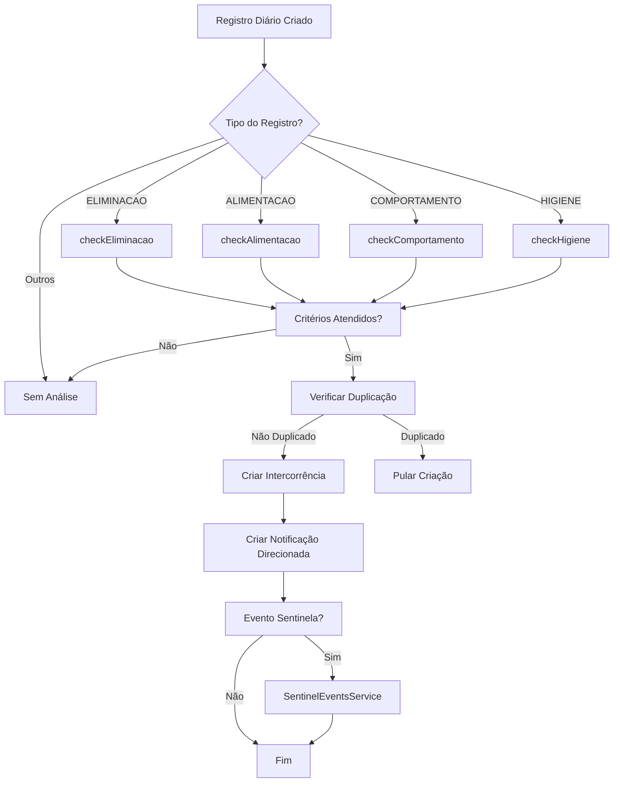

# Intercorrências Automáticas - RDC 502/2021

## 📋 Visão Geral

O sistema **Rafa ILPI** implementa detecção automática de intercorrências baseada nas diretrizes da **RDC 502/2021 da ANVISA**. O objetivo é identificar eventos críticos em tempo real através da análise de registros diários, garantindo intervenção rápida e documentação adequada.

### Características Principais

- ✅ **Detecção em Tempo Real**: Análise imediata após criação de registro diário
- ✅ **Prevenção de Duplicação**: Verifica existência de intercorrência similar no mesmo dia
- ✅ **Notificações Direcionadas**: Alertas enviados para Admin, Responsável Técnico e autor do registro
- ✅ **Indicadores RDC**: Rastreamento automático dos 6 indicadores obrigatórios da ANVISA
- ✅ **Eventos Sentinela**: Identificação e workflow especial para eventos críticos

---

## 🎯 Tipos de Registros Analisados

O sistema analisa **4 tipos de registros diários**:

| Tipo | Intercorrências Detectadas | Indicadores RDC |
|------|----------------------------|-----------------|
| **ELIMINACAO** | Diarreia, Desidratação | 2 indicadores |
| **ALIMENTACAO** | Recusa alimentar, Desnutrição, Vômito, Engasgo | 1 indicador |
| **COMPORTAMENTO** | Agitação psicomotora, Agressividade | - |
| **HIGIENE** | Úlcera de decúbito | 1 indicador |

---

## 📊 Detalhamento das Intercorrências

### 1️⃣ ELIMINACAO → Intercorrências Clínicas

#### 🔴 Doença Diarréica Aguda (Indicador RDC)

**Critério de Detecção:**
```typescript
// Campo: data.consistencia
consistencia?.toLowerCase().includes('diarr') ||
consistencia?.toLowerCase().includes('líquida') ||
consistencia?.toLowerCase().includes('liquida')
```

**Classificação:**
- **Subtipo**: `DOENCA_DIARREICA_AGUDA`
- **Categoria**: `CLINICA`
- **Severidade**: `MODERADA`
- **Indicador RDC**: ✅ `DIARREIA_AGUDA`

**Ação Automática:**
```
Monitorar hidratação, frequência das evacuações e sinais de desidratação.
Comunicar enfermagem e avaliar necessidade de soro oral.
```

**Label de Notificação:**
```
"Doença Diarréica Aguda (Indicador RDC)"
```

---

#### 🔴 Desidratação (Indicador RDC)

**Critério de Detecção:**
```typescript
// Contagem de evacuações diarreicas no mesmo dia
const evacuacoesNoDia = await tenantClient.dailyRecord.count({
  where: {
    residentId: record.residentId,
    type: 'ELIMINACAO',
    date: record.date,
    deletedAt: null,
  },
});

// Dispara se >= 3 evacuações diarreicas
if (evacuacoesNoDia >= 3 && consistenciaDiarreica)
```

**Classificação:**
- **Subtipo**: `DESIDRATACAO`
- **Categoria**: `CLINICA`
- **Severidade**: `GRAVE` ⚠️
- **Indicador RDC**: ✅ `DESIDRATACAO`

**Ação Automática:**
```
URGENTE: Avaliar sinais de desidratação (mucosas secas, turgor cutâneo, diurese).
Iniciar reposição hídrica. Comunicar médico imediatamente.
```

**Label de Notificação:**
```
"Desidratação (Indicador RDC)"
```

**Prevenção de Duplicação:**
- ✅ Verifica se já existe registro de `DESIDRATACAO` no mesmo dia antes de criar

---

### 2️⃣ ALIMENTACAO → Intercorrências Assistenciais e Clínicas

#### 🟡 Recusa de Alimentação - Recusa Total

**Critério de Detecção:**
```typescript
// Campo: data.ingeriu
data.ingeriu === 'Recusou'
```

**Classificação:**
- **Subtipo**: `RECUSA_ALIMENTACAO`
- **Categoria**: `ASSISTENCIAL`
- **Severidade**: `MODERADA`
- **Indicador RDC**: ❌

**Ação Automática:**
```
Investigar causa da recusa (dor, náusea, preferências, depressão).
Oferecer alternativas. Monitorar padrão de aceitação alimentar.
```

**Label de Notificação:**
```
"Recusa de Alimentação"
```

---

#### 🟡 Recusa de Alimentação - Ingestão Mínima

**Critério de Detecção:**
```typescript
// Campo: data.ingeriu
data.ingeriu === '<25%'
```

**Classificação:**
- **Subtipo**: `RECUSA_ALIMENTACAO`
- **Categoria**: `ASSISTENCIAL`
- **Severidade**: `LEVE`
- **Indicador RDC**: ❌

**Ação Automática:**
```
Investigar causa da recusa (dor, náusea, preferências, depressão).
Oferecer alternativas. Monitorar padrão de aceitação alimentar.
```

---

#### 🔴 Desnutrição (Indicador RDC)

**Critério de Detecção:**
```typescript
// Contagem de recusas alimentares no mesmo dia
const recusasNoDia = await tenantClient.dailyRecord.count({
  where: {
    residentId: record.residentId,
    type: 'ALIMENTACAO',
    date: record.date,
    data: {
      path: ['ingeriu'],
      string_contains: 'Recusou',
    },
    deletedAt: null,
  },
});

// Dispara se >= 2 recusas no dia
if (recusasNoDia >= 2)
```

**Classificação:**
- **Subtipo**: `DESNUTRICAO`
- **Categoria**: `CLINICA`
- **Severidade**: `GRAVE` ⚠️
- **Indicador RDC**: ✅ `DESNUTRICAO`

**Ação Automática:**
```
URGENTE: Avaliar sinais de desnutrição (perda de peso, IMC, albumina).
Avaliar necessidade de suplementação. Comunicar nutricionista e médico.
```

**Label de Notificação:**
```
"Desnutrição (Indicador RDC)"
```

**Prevenção de Duplicação:**
- ✅ Verifica se já existe registro de `DESNUTRICAO` no mesmo dia antes de criar

---

#### 🟡 Vômito

**Critério de Detecção:**
```typescript
// Campo: data.intercorrencia
data.intercorrencia === 'Vômito'
```

**Classificação:**
- **Subtipo**: `VOMITO`
- **Categoria**: `CLINICA`
- **Severidade**: `MODERADA`
- **Indicador RDC**: ❌

**Ação Automática:**
```
Avaliar causa e monitorar.
```

**Label de Notificação:**
```
"Vômito"
```

**Nota Importante:**
- ⚠️ Não cria intercorrência se já foi criada `RECUSA_ALIMENTACAO` para o mesmo registro

---

#### 🔴 Engasgo

**Critério de Detecção:**
```typescript
// Campo: data.intercorrencia
data.intercorrencia === 'Engasgo'
```

**Classificação:**
- **Subtipo**: `OUTRA_CLINICA`
- **Categoria**: `CLINICA`
- **Severidade**: `GRAVE` ⚠️
- **Indicador RDC**: ❌

**Ação Automática:**
```
URGENTE: Verificar via aérea e saturação de O2.
```

**Label de Notificação:**
```
"Outra Intercorrência Clínica"
```

---

#### 🟢 Náusea

**Critério de Detecção:**
```typescript
// Campo: data.intercorrencia
data.intercorrencia === 'Náusea'
```

**Classificação:**
- **Subtipo**: `OUTRA_CLINICA`
- **Categoria**: `CLINICA`
- **Severidade**: `LEVE`
- **Indicador RDC**: ❌

**Ação Automática:**
```
Avaliar causa e monitorar.
```

---

### 3️⃣ COMPORTAMENTO → Intercorrências Assistenciais

#### 🟢 Agitação Psicomotora - Ansiedade

**Critério de Detecção:**
```typescript
// Campo: data.estadoEmocional
data.estadoEmocional === 'Ansioso'
```

**Classificação:**
- **Subtipo**: `AGITACAO_PSICOMOTORA`
- **Categoria**: `ASSISTENCIAL`
- **Severidade**: `LEVE`
- **Indicador RDC**: ❌

**Ação Automática:**
```
Oferecer ambiente calmo e atividades relaxantes.
Avaliar necessidade de medicação SOS para ansiedade.
```

**Label de Notificação:**
```
"Agitação Psicomotora"
```

---

#### 🟡 Agitação Psicomotora - Euforia

**Critério de Detecção:**
```typescript
// Campo: data.estadoEmocional
data.estadoEmocional === 'Eufórico'
```

**Classificação:**
- **Subtipo**: `AGITACAO_PSICOMOTORA`
- **Categoria**: `ASSISTENCIAL`
- **Severidade**: `MODERADA`
- **Indicador RDC**: ❌

**Ação Automática:**
```
Monitorar para evitar riscos (quedas, conflitos).
Avaliar necessidade de ajuste medicamentoso.
```

---

#### 🟡 Agressividade

**Critério de Detecção:**
```typescript
// Campo: data.estadoEmocional
data.estadoEmocional === 'Irritado'
```

**Classificação:**
- **Subtipo**: `AGRESSIVIDADE`
- **Categoria**: `ASSISTENCIAL`
- **Severidade**: `MODERADA`
- **Indicador RDC**: ❌

**Ação Automática:**
```
Manter distância segura. Usar comunicação calma e não-confrontacional.
Avaliar causa da irritabilidade.
```

**Label de Notificação:**
```
"Agressividade"
```

---

### 4️⃣ HIGIENE → Intercorrências Clínicas

#### 🔴 Úlcera de Decúbito (Indicador RDC)

**Critério de Detecção:**
```typescript
// Campo: data.observacoes (case-insensitive)
const keywords = [
  'lesão', 'lesao',
  'úlcera', 'ulcera',
  'ferida',
  'escara',
  'decúbito', 'decubito',
  'vermelhidão', 'vermelhidao',
  'bolha',
];

const encontrouLesao = keywords.some(keyword =>
  observacoes.toLowerCase().includes(keyword)
);
```

**Classificação:**
- **Subtipo**: `ULCERA_DECUBITO`
- **Categoria**: `CLINICA`
- **Severidade**: `GRAVE` ⚠️
- **Indicador RDC**: ✅ `ULCERA_DECUBITO`

**Ação Automática:**
```
URGENTE: Avaliar lesão (localização, estágio, tamanho).
Documentar com foto. Iniciar protocolo de prevenção/tratamento.
Comunicar enfermagem e médico.
```

**Label de Notificação:**
```
"Úlcera de Decúbito (Indicador RDC)"
```

---

## 🚨 Eventos Sentinela

### O que são Eventos Sentinela?

**Eventos Sentinela** são ocorrências graves que resultam em morte ou dano permanente ao paciente. Segundo a RDC 502/2021, são de **notificação obrigatória** à ANVISA.

### Eventos Sentinela no Sistema

O sistema identifica automaticamente **2 eventos sentinela**:

| Subtipo | Label | Workflow Especial |
|---------|-------|-------------------|
| `QUEDA_COM_LESAO` | 🚨 Queda com Lesão (Evento Sentinela) | ✅ Sim |
| `TENTATIVA_SUICIDIO` | 🚨 Tentativa de Suicídio (Evento Sentinela) | ✅ Sim |

### Workflow Automático

Quando um Evento Sentinela é detectado:

1. ✅ **Intercorrência criada** com `isEventoSentinela = true`
2. ✅ **Notificação direcionada** enviada (Admin + RT + Autor)
3. ✅ **Event emitido**: `daily-record.created`
4. ✅ **SentinelEventsService** processa automaticamente:
   - Cria registro em `SentinelEventNotification`
   - Protocolo de notificação gerado
   - Email enviado para responsáveis
   - Status: `PENDENTE` → `ENVIADO` → `CONFIRMADO`

**Código-fonte**: [apps/backend/src/sentinel-events/sentinel-events.service.ts](../apps/backend/src/sentinel-events/sentinel-events.service.ts)

---

## 📊 Indicadores RDC 502/2021

A RDC 502/2021 exige o cálculo mensal de **6 indicadores obrigatórios**. O sistema rastreia automaticamente:

| Indicador | Subtipo Detectado | Tipo | Fórmula |
|-----------|-------------------|------|---------|
| **Taxa de Mortalidade** | `OBITO` | Incidência | (Óbitos / Total residentes) × 100 |
| **Diarreia Aguda** | `DOENCA_DIARREICA_AGUDA` | Incidência | (Casos / Total residentes) × 100 |
| **Escabiose** | `ESCABIOSE` | Incidência | (Casos / Total residentes) × 100 |
| **Desidratação** | `DESIDRATACAO` | Incidência | (Casos / Total residentes) × 100 |
| **Úlcera de Decúbito** | `ULCERA_DECUBITO` | Prevalência | (Casos ativos / Total residentes) × 100 |
| **Desnutrição** | `DESNUTRICAO` | Prevalência | (Casos ativos / Total residentes) × 100 |

### Cálculo Automático

- 🔄 **Periodicidade**: Mensal
- 📅 **Execução**: `RdcIndicatorsService` (pode ser disparado manualmente ou via cron job)
- 💾 **Armazenamento**: Tabela `IncidentMonthlyIndicator`
- 📊 **Endpoint**: `POST /api/rdc-indicators/calculate`

**Código-fonte**: [apps/backend/src/rdc-indicators/rdc-indicators.service.ts](../apps/backend/src/rdc-indicators/rdc-indicators.service.ts)

---

## 🔔 Sistema de Notificações

### Notificações Direcionadas

Todas as intercorrências automáticas geram **notificações direcionadas** para:

1. ✅ **Administradores** (`role = ADMIN`)
2. ✅ **Responsável Técnico** (campo `isTechnicalResponsible = true` - *TODO: adicionar ao schema*)
3. ✅ **Autor do registro** (`userId` que criou o registro diário)

### Estrutura da Notificação

```typescript
{
  type: SystemNotificationType.INCIDENT_CREATED,
  category: NotificationCategory.INCIDENT,
  severity: NotificationSeverity.CRITICAL | WARNING | INFO,
  title: 'Intercorrência Detectada Automaticamente',
  message: 'Nome do Residente: Label Formatado',
  actionUrl: '/dashboard/registros-diarios',
  entityType: 'DAILY_RECORD',
  entityId: 'uuid-do-registro',
  metadata: {
    residentId: 'uuid',
    residentName: 'Nome Completo',
    category: 'CLINICA | ASSISTENCIAL | ADMINISTRATIVA',
    subtypeClinical?: 'ENUM_VALUE',
    subtypeAssist?: 'ENUM_VALUE',
    severity: 'LEVE | MODERADA | GRAVE | CRITICA',
    isEventoSentinela: boolean,
    deteccaoAutomatica: true,
  },
}
```

### Mapeamento de Severidade

```typescript
// Severidade da Intercorrência → Severidade da Notificação
GRAVE → CRITICAL (vermelho)
MODERADA → WARNING (amarelo/laranja)
LEVE → INFO (azul)
```

### Labels Formatados

O sistema utiliza **labels amigáveis** sincronizados com o frontend:

- ✅ Emojis 🚨 para Eventos Sentinela
- ✅ Marcação "(Indicador RDC)" para indicadores obrigatórios
- ✅ Textos descritivos em português

**Exemplo**:
```
"🚨 Queda com Lesão (Evento Sentinela)"
"Desidratação (Indicador RDC)"
"Queda sem Lesão"
```

**Código-fonte**: [apps/backend/src/daily-records/utils/incident-formatters.ts](../apps/backend/src/daily-records/utils/incident-formatters.ts)

---

## 🛡️ Prevenção de Duplicação

O sistema implementa **verificação de duplicação** antes de criar intercorrências automáticas:

```typescript
const existingIncident = await tenantClient.dailyRecord.findFirst({
  where: {
    residentId,
    type: 'INTERCORRENCIA',
    date,
    incidentCategory: category,
    ...(subtypeClinical && { incidentSubtypeClinical: subtypeClinical }),
    ...(subtypeAssist && { incidentSubtypeAssist: subtypeAssist }),
    deletedAt: null,
  },
});

if (existingIncident) {
  this.logger.debug('Intercorrência similar já existe, pulando criação automática');
  return;
}
```

### Critérios de Duplicação

Uma intercorrência é considerada **duplicada** se houver registro com:
- ✅ Mesmo `residentId`
- ✅ Mesma `date`
- ✅ Mesma `category`
- ✅ Mesmo `subtype` (clínico, assistencial ou administrativo)
- ✅ `deletedAt = null` (não foi deletado)

---

## 🏗️ Arquitetura Técnica

### Fluxo de Execução



### Estrutura de Código

```
apps/backend/src/daily-records/
├── daily-records.service.ts           # Criação de registros diários
├── incident-interceptor.service.ts    # Detecção automática de intercorrências
└── utils/
    └── incident-formatters.ts         # Labels formatados

apps/backend/src/sentinel-events/
└── sentinel-events.service.ts         # Workflow de Eventos Sentinela

apps/backend/src/notifications/
└── notifications.service.ts           # Criação de notificações
```

### Métodos Principais

#### `IncidentInterceptorService`

| Método | Responsabilidade | Linhas |
|--------|------------------|--------|
| `analyzeAndCreateIncidents()` | Ponto de entrada - roteamento por tipo | 57-98 |
| `checkEliminacao()` | Detecta diarreia e desidratação | 105-184 |
| `checkAlimentacao()` | Detecta recusas, desnutrição e intercorrências | 191-307 |
| `checkComportamento()` | Detecta agitação e agressividade | 314-369 |
| `checkHigiene()` | Detecta úlceras de decúbito | 375-419 |
| `createAutoIncident()` | Cria intercorrência e notificação | 424-601 |

#### `DailyRecordsService`

| Método | Responsabilidade | Linhas |
|--------|------------------|--------|
| `create()` | Cria registro e dispara análise automática | 49-192 |

---

## 🧪 Testes

### Cenários de Teste Sugeridos

#### 1. Diarreia e Desidratação
```typescript
// Teste 1: Criar registro de eliminação com diarreia
POST /api/daily-records
{
  "type": "ELIMINACAO",
  "residentId": "...",
  "data": {
    "tipo": "Fezes",
    "consistencia": "Diarréica líquida"
  }
}
// Resultado esperado: Intercorrência DOENCA_DIARREICA_AGUDA criada

// Teste 2: Criar mais 2 registros de diarreia no mesmo dia
// Resultado esperado: Intercorrência DESIDRATACAO criada após a 3ª evacuação
```

#### 2. Recusa Alimentar e Desnutrição
```typescript
// Teste 1: Criar registro de recusa total
POST /api/daily-records
{
  "type": "ALIMENTACAO",
  "residentId": "...",
  "data": {
    "refeicao": "Almoço",
    "ingeriu": "Recusou"
  }
}
// Resultado esperado: Intercorrência RECUSA_ALIMENTACAO (MODERADA)

// Teste 2: Criar segunda recusa no mesmo dia
// Resultado esperado: Intercorrência DESNUTRICAO (GRAVE)
```

#### 3. Comportamento Alterado
```typescript
POST /api/daily-records
{
  "type": "COMPORTAMENTO",
  "residentId": "...",
  "data": {
    "estadoEmocional": "Ansioso"
  }
}
// Resultado esperado: Intercorrência AGITACAO_PSICOMOTORA (LEVE)
```

#### 4. Úlcera de Decúbito
```typescript
POST /api/daily-records
{
  "type": "HIGIENE",
  "residentId": "...",
  "data": {
    "observacoes": "Notada lesão por pressão na região sacral"
  }
}
// Resultado esperado: Intercorrência ULCERA_DECUBITO (GRAVE)
```

### Verificações Pós-Criação

Para cada teste, verificar:
1. ✅ Intercorrência criada em `DailyRecord` com `type = INTERCORRENCIA`
2. ✅ Campos corretos: `incidentCategory`, `incidentSubtype*`, `incidentSeverity`
3. ✅ Notificação criada em `Notification`
4. ✅ Destinatários corretos em `NotificationRecipient`
5. ✅ Label formatado no campo `message` da notificação
6. ✅ Se Evento Sentinela: registro em `SentinelEventNotification`

---

## 📝 Logs e Monitoramento

### Logs Gerados

#### Sucesso
```typescript
this.logger.log('Criando intercorrência automática', {
  residentId,
  category,
  subtypeClinical,
  subtypeAssist,
  severity,
  isEventoSentinela,
  rdcIndicators,
});

this.logger.log('Intercorrência automática criada com sucesso', {
  incidentRecordId: incidentRecord.id,
});

this.logger.log('Notificação de intercorrência criada (direcionada)', {
  incidentRecordId,
  residentName,
  recipientsCount,
});
```

#### Duplicação
```typescript
this.logger.debug('Intercorrência similar já existe, pulando criação automática', {
  residentId,
  date,
  category,
  subtypeClinical,
  subtypeAssist,
});
```

#### Erros
```typescript
this.logger.error('Erro ao analisar registro para intercorrências', {
  error: error.message,
  stack: error.stack,
  recordId: record.id,
});

this.logger.error('Erro ao criar notificação de intercorrência', {
  error: notificationError.message,
  stack: notificationError.stack,
  incidentRecordId: incidentRecord.id,
});
```

### Métricas Sugeridas

Para monitoramento em produção:
- 📊 **Total de intercorrências automáticas criadas** (por tipo, por dia)
- 📊 **Taxa de duplicação evitada** (quantas tentativas foram bloqueadas)
- 📊 **Tempo médio de processamento** (da criação do registro à notificação)
- 📊 **Eventos Sentinela** (contagem mensal)
- 📊 **Indicadores RDC** (valores mensais e tendências)

---

## 🔧 Configuração e Manutenção

### Adicionar Nova Regra de Detecção

1. **Escolher o tipo de registro** (`ELIMINACAO`, `ALIMENTACAO`, `COMPORTAMENTO`, `HIGIENE` ou criar novo)
2. **Editar método correspondente** em `IncidentInterceptorService`
3. **Definir critério de detecção** (campos do `data` JSON)
4. **Escolher classificação**:
   - Subtipo (enum `IncidentSubtype*`)
   - Categoria (`CLINICA`, `ASSISTENCIAL`, `ADMINISTRATIVA`)
   - Severidade (`LEVE`, `MODERADA`, `GRAVE`, `CRITICA`)
   - Indicador RDC (se aplicável)
5. **Chamar `createAutoIncident()`** com os parâmetros corretos
6. **Adicionar label formatado** em `incident-formatters.ts` (se novo subtipo)
7. **Atualizar esta documentação**

### Desabilitar Detecção Temporariamente

Para desabilitar temporariamente a detecção automática:

```typescript
// Em daily-records.service.ts, comentar:
// await this.incidentInterceptorService.analyzeAndCreateIncidents(record, userId);
```

Para desabilitar tipo específico:
```typescript
// Em incident-interceptor.service.ts, comentar case:
switch (record.type) {
  // case 'ELIMINACAO':
  //   await this.checkEliminacao(record, userId);
  //   break;
  case 'ALIMENTACAO':
    await this.checkAlimentacao(record, userId);
    break;
  // ...
}
```

---

## 📚 Referências

### Legislação
- [RDC 502/2021 - ANVISA](https://www.in.gov.br/en/web/dou/-/resolucao-rdc-n-502-de-27-de-maio-de-2021-323531636) - Regulamento Técnico sobre requisitos para funcionamento de ILPI

### Código-Fonte
- [apps/backend/src/daily-records/incident-interceptor.service.ts](../apps/backend/src/daily-records/incident-interceptor.service.ts) - Detecção automática
- [apps/backend/src/daily-records/daily-records.service.ts](../apps/backend/src/daily-records/daily-records.service.ts) - Criação de registros
- [apps/backend/src/daily-records/utils/incident-formatters.ts](../apps/backend/src/daily-records/utils/incident-formatters.ts) - Labels formatados
- [apps/backend/src/sentinel-events/sentinel-events.service.ts](../apps/backend/src/sentinel-events/sentinel-events.service.ts) - Workflow de Eventos Sentinela
- [apps/backend/src/notifications/notifications.service.ts](../apps/backend/src/notifications/notifications.service.ts) - Sistema de notificações
- [apps/backend/src/rdc-indicators/rdc-indicators.service.ts](../apps/backend/src/rdc-indicators/rdc-indicators.service.ts) - Cálculo de indicadores

### Documentação Relacionada
- [docs/architecture/multi-tenancy.md](./architecture/multi-tenancy.md) - Arquitetura multi-tenant
- [docs/architecture/notifications.md](./architecture/notifications.md) - Sistema de notificações *(se existir)*
- [docs/modules/sentinel-events.md](./modules/sentinel-events.md) - Eventos Sentinela *(se existir)*

---

**Última atualização**: 2026-01-20
**Versão**: 1.0
**Autor**: Rafa Labs - Sistema Rafa ILPI
